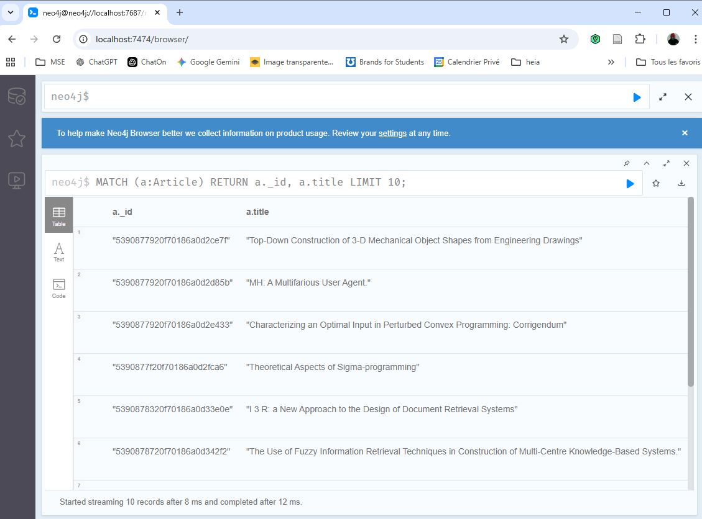
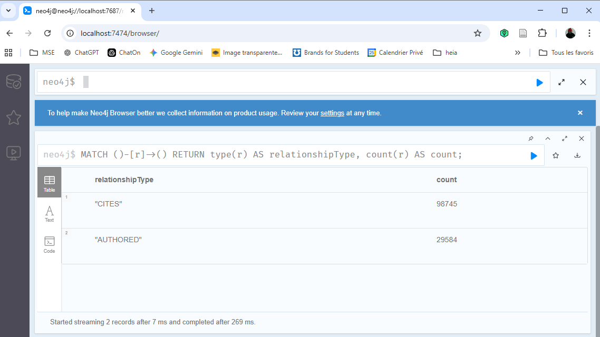

# Laboratory 2 - Diving deeper with Neo4j
- Auteur: Nicolas Hertling
- Date: 04.05.2026
- Version 1.0
#
- namespace: hertl-adv-daba-26
- repo git: [https://github.com/nicoh1801/mse-advDaBa-Labo2](https://github.com/nicoh1801/mse-advDaBa-Labo2)
- ID exact du pod Neo4j: neo4j-6b6c5dc9f4-tw5qb
- ID du pod/job loader: neo4j-loader-psfc7
- Credentials Neo4j: User: neo4j Password: test

#

L'objectif global de ce travail pratique est de charger progressivement le dataset SBLP dans Neo4j. 

Le dataset est founis sous la forme d'un fichier JSONL. Chaque ligne correspond à un article. Le but est de transformer ces données en graphe Neo4j avec:
- des noeuds "article"
- des noeuds "author"
- des relations "authored" entre auteurs et articles 
- des relations "cites" entre articles

## Chargement des données avec le loader Java

Le chargement est fait par la classe [Loader.java](src/main/java/mse/advDB/Loader.java). Cette classe lit les données depuis une URL, extrait les articles, auteurs et citations puis les insère dans Neo4j par lots.

### Configuration par variables d'environnement 

Le loader ne contient pas de config fixe. Les paramètres importants sont lus depuis les variables d'envrionnement.
```
String jsonUrl = getenv("JSON_FILE_URL", "http://vmrum.isc.heia-fr.ch/files/test.jsonl");
int maxArticles = Integer.parseInt(getenv("MAX_NODES", "10000"));
int batchSize = Integer.parseInt(getenv("BATCH_SIZE", "1000"));

String neo4jIp = getenv("NEO4J_IP", "localhost");
String neo4jUser = getenv("NEO4J_USER", "neo4j");
String neo4jPassword = getenv("NEO4J_PASSWORD", "test");
```
### Configuration par variables d'environnement 

Comme décrit dans l'Example.java qui a été fourné, le loader se connecte à Neo4j avec le driver officiel Neo4j java et le port 7687 qui est le port Bolt de Neo4j qui est utilisé par l'app Java pour envoyer des requêtes Cypher.
```
Driver driver = GraphDatabase.driver(
                "bolt://" + neo4jIp + ":7687",
                AuthTokens.basic(neo4jUser, neo4jPassword)
);
```

### Création des contraintes
Avant d'insérer les données, le prgramme créer deux contraites permettant d'éviter de créer plusieurs fois le même article ou le même auteur.

```
private static void createConstraints(Session session) {
        session.writeTransaction(tx -> {
            tx.run(
                    "CREATE CONSTRAINT article_id IF NOT EXISTS " +
                            "FOR (a:Article) " +
                            "REQUIRE a._id IS UNIQUE"
            );

            tx.run(
                    "CREATE CONSTRAINT author_id IF NOT EXISTS " +
                            "FOR (a:Author) " +
                            "REQUIRE a._id IS UNIQUE"
            );

            return null;
        });
    }

```


### Lecture du fichier JSONL en streaming
Le fichier est lu ligne par ligne depuis l'URL configuréer. Chaque ligne est ensuite convertie en object JSON.
```
URL url = new URL(jsonUrl);
BufferedReader br = new BufferedReader(new InputStreamReader(url.openStream()));

String line;

while ((line = br.readLine()) != null && articleCount < maxArticles) {
    JsonNode json = mapper.readTree(line);
```
### Extraction des articles

Pour chaque ligne, le loader récupère l'identifiant et le titre de l'article. SI l'article possède un identifiant valide, il est ajouté au batch. L'dentifiant JSON est utilisé comme priorité _id dans Neo4j.


```
String articleId = getText(json, "id");
String title = getText(json, "title");

if (articleId == null || articleId.trim().isEmpty()) {
    continue;
}

Map<String, Object> articleMap = new HashMap<String, Object>();
articleMap.put("id", articleId);
articleMap.put("title", title == null ? "" : title);
articleBatch.add(articleMap);
```

### Extraction des auteurs
Les auteurs sont lus depuis le champ authors. Pour chaque auteur, le programme répcupère son identifiant et son nom.

```
JsonNode authors = json.get("authors");
if (authors != null && authors.isArray()) {
    for (JsonNode author : authors) {
        String authorId = getText(author, "id");
        String authorName = getText(author, "name");

        if (authorId == null || authorId.trim().isEmpty()) {
            continue;
        }

        uniqueAuthors.add(authorId);

        Map<String, Object> authorMap = new HashMap<String, Object>();
        authorMap.put("id", authorId);
        authorMap.put("name", authorName == null ? "" : authorName);
        authorBatch.add(authorMap);

        Map<String, Object> authoredMap = new HashMap<String, Object>();
        authoredMap.put("authorId", authorId);
        authoredMap.put("articleId", articleId);
        authoredBatch.add(authoredMap);
    }
}
```


### Extraction des citations
Les citations quant à elle sont lues depuis le champ references. Pour chque citation le loader prépare une relation entre l'article courant et l'article cité. Même si l'article cité n'a pas encore été lu dans le fichier, il peut déjà être créé dans Neo4j avec son _id. Son titre sera complété plus tard si l'article apparaît dans le dataset.

```
JsonNode references = json.get("references");
if (references != null && references.isArray()) {
    for (JsonNode ref : references) {
        if (ref == null || !ref.isTextual()) {
            continue;
        }

        String citedId = ref.asText();

        Map<String, Object> citationMap = new HashMap<String, Object>();
        citationMap.put("articleId", articleId);
        citationMap.put("citedId", citedId);
        citationBatch.add(citationMap);
    }
}
```

### insertion par batchs
Pour éviter d'envoyer une reuqête par ligne, les données sont insérées par batch. la taille du batch est configurable avec BATCH_SIZE. 

```
if (articleCount % batchSize == 0) {
    insertBatch(session, articleBatch, authorBatch, authoredBatch, citationBatch);

    long elapsed = (System.currentTimeMillis() - start) / 1000;

    System.out.println(
            "PROGRESS articles=" + articleCount +
                    " authors=" + uniqueAuthors.size() +
                    " totalNodes=" + (articleCount + uniqueAuthors.size()) +
                    " elapsedSeconds=" + elapsed
    );

    articleBatch.clear();
    authorBatch.clear();
    authoredBatch.clear();
    citationBatch.clear();
    }
```

à chaque batch, les articles, auteurs, relation authored et cites sont insérés. UNWIND permet d'envoyer une liste de données à Neo4j et de les traiter côté db.


```
private static void insertBatch(
            Session session,
            final List<Map<String, Object>> articles,
            final List<Map<String, Object>> authors,
            final List<Map<String, Object>> authored,
            final List<Map<String, Object>> citations
    ) {
        session.writeTransaction(tx -> {
            tx.run(
                    "UNWIND $articles AS row " +
                            "MERGE (a:Article {_id: row.id}) " +
                            "SET a.title = row.title",
                    parameters("articles", articles)
            );

            tx.run(
                    "UNWIND $authors AS row " +
                            "MERGE (a:Author {_id: row.id}) " +
                            "SET a.name = row.name",
                    parameters("authors", authors)
            );

            tx.run(
                    "UNWIND $authored AS row " +
                            "MATCH (author:Author {_id: row.authorId}) " +
                            "MATCH (article:Article {_id: row.articleId}) " +
                            "MERGE (author)-[:AUTHORED]->(article)",
                    parameters("authored", authored)
            );

            tx.run(
                    "UNWIND $citations AS row " +
                            "MATCH (article:Article {_id: row.articleId}) " +
                            "MERGE (cited:Article {_id: row.citedId}) " +
                            "MERGE (article)-[:CITES]->(cited)",
                    parameters("citations", citations)
            );

            return null;
        });
    }
```


## Déploiement local avec Docker Compose
Pour tester localement, un docker compose est utiliser avec deux conteneurs, un db contenant Neo4j et un app contenant le loader java. Celui-ci a en grande partie été mis à disposition dans le repo de base.  

```
services:
  db:
    image: neo4j:4.4.15-community
    ports:
      - "7474:7474"
      - "7687:7687"
    networks:
      internal:
        ipv4_address: 172.24.0.10
    volumes:
      - $PWD/neo4j_mount/data:/data
      - $PWD/neo4j_mount/logs:/logs
      - $PWD/neo4j_mount/conf:/conf
    environment:
      - NEO4J_AUTH=neo4j/test
    deploy:
      resources:
        limits:
          memory: 3g

  app:
    image: neo4jtp:latest
    depends_on:
      - db
    networks:
      - internal
    volumes:
      - $PWD/dblpExample.jsonl:/file.jsonl
    environment:
      - JSON_FILE_URL=http://vmrum.isc.heia-fr.ch/files/DBLP-Citation-network-V18.jsonl 
      - MAX_NODES=10000
      - NEO4J_IP=172.24.0.10 # must be the same as above
      - NEO4J_USER=neo4j
      - NEO4J_PASSWORD=test
      - BATCH_SIZE=1
    deploy:
      resources:
        limits:
          memory: 4g

networks:
  internal:
    ipam:
      driver: default
      config:
        - subnet: "172.24.0.0/24"

```

## Prmier résultat local
Avec la configuration suivante:
```
- JSON_FILE_URL=http://vmrum.isc.heia-fr.ch/files/DBLP-Citation-network-V18.jsonl 
- MAX_NODES=10000
- BATCH_SIZE=1000
```

Avant le test, la base local Neo4j a été supprimée afin de repartir à vide:

```
docker compose down
Remove-Item -Recurse -Force .\neo4j_mount
docker compose up
```
Le loader a ensuite lu le fichier JSONL depuis l'url et a inséré les data dans neo4j par batch de 1000 acticles. Les logs sont les suivants:

```
LOAD_START=2026-05-02T17:27:36.256127980Z
JSON_URL=http://vmrum.isc.heia-fr.ch/files/DBLP-Citation-network-V18.jsonl
MAX_ARTICLES=10000
BATCH_SIZE=1000
NEO4J_IP=172.24.0.10

PROGRESS articles=1000 authors=2584 totalNodes=3584 elapsedSeconds=46
PROGRESS articles=2000 authors=5114 totalNodes=7114 elapsedSeconds=48
PROGRESS articles=3000 authors=7934 totalNodes=10934 elapsedSeconds=50
PROGRESS articles=4000 authors=11001 totalNodes=15001 elapsedSeconds=52
PROGRESS articles=5000 authors=14351 totalNodes=19351 elapsedSeconds=53
PROGRESS articles=6000 authors=17803 totalNodes=23803 elapsedSeconds=55
PROGRESS articles=7000 authors=20858 totalNodes=27858 elapsedSeconds=56
PROGRESS articles=8000 authors=23265 totalNodes=31265 elapsedSeconds=57
PROGRESS articles=9000 authors=25713 totalNodes=34713 elapsedSeconds=57
PROGRESS articles=10000 authors=28309 totalNodes=38309 elapsedSeconds=58

LOAD_END=2026-05-02T17:28:34.826419941Z
ARTICLES_LOADED=10000
AUTHORS_LOADED=28309
TOTAL_NODES=38309
DURATION_SECONDS=58
```

Pour ce test local, le program à donc chargé:

```
Articles : 10 000
Auteurs distincts : 28 309
Total de noeuds : 38 309
Durée : 58 secondes
```
Quelques vérifications directement via l'interface de Neo4j ont été fait afin de voir le bon chargement des datas.





## Déploiement sur Kubernetes

Le déploiement final a été réaliser sur le cluster Kubernetes de l'école, dans le namespace **hertl-adv-daba-26**.
L'objectif du déploiemne test d'avoir deux composants séparés. Un pod Neo4j qui contient la base de données et conserve les données chargées et un job kubernetes neo4j-loader qui lance le programme java pour le chargement. 

Contrairement au déloiement local avec docker compose, le loader ne se connecte pas à neo4j avec une IP fixe. Dans kubernetes, je créer un service nommé neo4j  qui permettra au pod du loader de résoudre automatiquement  l'adresse du pod Neo4j via le dns interne de kubernetes.
```
- name: NEO4J_IP
  value: "neo4j"
```

### Image docker du loader

Pour que Kubernetes puisse lancer le loader, l'image Docker ne peut pas rester uniquement sur la machine local. Elle doit être disponible dans un registry docker. 
l'image local a donc été taguée puis poussée sur Docker Hub:
```
docker tag neo4jtp:latest nicolasdockerhertling/neo4jtp:latest
docker push nicolasdockerhertling/neo4jtp:latest
```
L'image est utilisée après dans le job kubernetes:
```
image: nicolasdockerhertling/neo4jtp:latest
```

### Fichiers Kubernetes


Les fichiers Kubernetes ont été placés dans le dossier [k8s/](k8s/).
```
k8s/neo4j-pvc.yaml
k8s/neo4j-deployment.yaml
k8s/neo4j-service.yaml
k8s/loader-job.yaml
```

Le fichier [neo4j-pvc.yaml](k8s/neo4j-pvc.yaml) créer un volume persistant pur conserver les data Neo4j.

Le fichier [neo4j-deployment.yaml](k8s/neo4j-deployment.yamll) lance le pod Neo4j avec l'image officiel. 


[neo4j-service.yaml](k8s/neo4j-service.yamll)  expose Neo4j à l'intéreieur du namespace Kubernetes notamment sur le port bolt 7687.

Finalement, le fichier [loader-job.yaml](k8s/loader-job.yamll) lance le programme java de chargement. Les données sont chargées via l'url "http://vmrum.isc.heia-fr.ch/files/DBLP-Citation-network-V18.jsonl", avec les paramètres suivants:
```
- name: JSON_FILE_URL
    value: "http://vmrum.isc.heia-fr.ch/files/DBLP-Citation-network-V18.jsonl"
- name: MAX_NODES
    value: "1000000"
- name: BATCH_SIZE
    value: "1000"
- name: NEO4J_IP
    value: "neo4j"
- name: NEO4J_USER
    value: "neo4j"
- name: NEO4J_PASSWORD
    value: "test"
```


### Déploiement de Neo4j

Les ressources Neo4j sont créees avec les commande suivantes:
```
kubectl apply -f k8s/neo4j-pvc.yaml -n hertl-adv-daba-26
kubectl apply -f k8s/neo4j-deployment.yaml -n hertl-adv-daba-26
kubectl apply -f k8s/neo4j-service.yaml -n hertl-adv-daba-26
```

Après le déploiement, on peut vérifier relativement facilement si le bod Neo4j a bien démarré:

```
kubectl get pods -n hertl-adv-daba-26
```

```
NAME                     READY   STATUS    RESTARTS   AGE
neo4j-6b6c5dc9f4-92dk7   1/1     Running   0          13s
```

### Déploiement du Loader
Le loder est déployé sous fome de Job. Ce qui signifie qu'il s'exécute une fois, charge les données et se termine. 

Pour lancer le job:
```
kubectl apply -f k8s/loader-job.yaml -n hertl-adv-daba-26
```
Voir logs:
```
kubectl logs job/neo4j-loader -n hertl-adv-daba-26
```
suvire logs:
```
kubectl logs -f job/neo4j-loader -n hertl-adv-daba-26
```

### Redémarrage d'un test

Quand on mdofiier le loader-job.yaml, Kuberrnetes ne met pas automatiquement à jour un job existant. Il faut supprimer l'acien job et le recréer:
```
kubectl delete job neo4j-loader -n hertl-adv-daba-26
kubectl apply -f k8s/loader-job.yaml -n hertl-adv-daba-26
```
Pour remartir d'un base complètement vide, il faut aussi supprimer le déploiement neo4j et son volume persistant:
```
kubectl delete job neo4j-loader -n hertl-adv-daba-26
kubectl delete deployment neo4j -n hertl-adv-daba-26
kubectl delete pvc neo4j-data -n hertl-adv-daba-26
```
Et recréer:
```
kubectl apply -f k8s/neo4j-pvc.yaml -n hertl-adv-daba-26
kubectl apply -f k8s/neo4j-deployment.yaml -n hertl-adv-daba-26
kubectl apply -f k8s/neo4j-service.yaml -n hertl-adv-daba-26
```
et relancer le loader:

```
kubectl apply -f k8s/loader-job.yaml -n hertl-adv-daba-26
```
### Streaming et batchs

Dans la consigne, on demande que les données soient streamées depuis l'URL fournie. Ce qui ne signifie pas qu'il faut insérer un article à la fois dans Neo4j. Afin de permettre les deux, le ficheir JSONL est lu en streaming, ligne par ligne :
```
URL url = new URL(jsonUrl);
BufferedReader br = new BufferedReader(new InputStreamReader(url.openStream()));

String line;

while ((line = br.readLine()) != null && articleCount < maxArticles) {
    JsonNode json = mapper.readTree(line);
```
Le fichier complet n'est donc jamais copié dans le conteneur et n'est jamais chargé entièrement en mémoire.

Le paramètre **BATCH_SIZE** sert uniquement à grouper les insertions dans Neo4j. Avec un BATCH_SIZE de 1000, le programme lit tjrs les données en streaming, mais insère les données dans Neo4j tous les 1000 articles, permettant de diminuer fortement le nbre de transactions envoyées à la base et améliorant les performances. 

Un essaie avec BATCH_SIZE=1 a montér que cette configuration est beacucoup plu lente, car elle créer une transaction par article. Pour les tests significatifs, j'ai choisir d'utiliser BATCH_SIZE=1000.


### Résultat Kubernetes avec 10 000 articles

un premier test kubernetes a été réalisé avec la configuration suivante:

```
- name: MAX_NODES
  value: "10000"
- name: BATCH_SIZE
  value: "1000"
```

Les logs importants sont les suivants:
```
LOAD_START=2026-05-03T19:39:25.877196755Z
JSON_URL=http://vmrum.isc.heia-fr.ch/files/DBLP-Citation-network-V18.jsonl
MAX_ARTICLES=10000
BATCH_SIZE=1000
NEO4J_IP=neo4j

PROGRESS articles=1000 authors=2584 totalNodes=3584 elapsedSeconds=8
PROGRESS articles=2000 authors=5114 totalNodes=7114 elapsedSeconds=9
PROGRESS articles=3000 authors=7934 totalNodes=10934 elapsedSeconds=11
PROGRESS articles=4000 authors=11001 totalNodes=15001 elapsedSeconds=13
PROGRESS articles=5000 authors=14351 totalNodes=19351 elapsedSeconds=14
PROGRESS articles=6000 authors=17803 totalNodes=23803 elapsedSeconds=16
PROGRESS articles=7000 authors=20858 totalNodes=27858 elapsedSeconds=18
PROGRESS articles=8000 authors=23265 totalNodes=31265 elapsedSeconds=19
PROGRESS articles=9000 authors=25713 totalNodes=34713 elapsedSeconds=20
PROGRESS articles=10000 authors=28309 totalNodes=38309 elapsedSeconds=21

LOAD_END=2026-05-03T19:39:47.659166507Z
ARTICLES_LOADED=10000
AUTHORS_LOADED=28309
TOTAL_NODES=38309
DURATION_SECONDS=21
```

Ce test a donc chargé:
- Articles complets lus : 10 000
- Auteurs distincts : 28 309
- Total articles + auteurs : 38 309
- Durée : 21 secondes
- Débit observé : 38 309 / 21 = environ 1825 noeuds  par secondes


### Résultat Kubernetes avec 100 000 articles

Un second test a été réalisé avec la config suivante:
```
- name: MAX_NODES
  value: "100000"
- name: BATCH_SIZE
  value: "1000"
```
Les logs important s sont les suivants:
```
PROGRESS articles=100000 authors=235438 totalNodes=335438 elapsedSeconds=134
LOAD_END=2026-05-03T20:20:48.595254376Z
ARTICLES_LOADED=100000
AUTHORS_LOADED=235438
TOTAL_NODES=335438
DURATION_SECONDS=134
```
Ce test a donc chargé:
- Articles complets lus : 100 000
- Auteurs distincts :  235 438
- Total articles + auteurs : 335 438
- Durée : 134  secondes
- Débit observé : 335 438 / 134 = environ 2503 noeuds  par secondes


### Résultat Kubernetes avec 1 000 000 articles

Un troisième test a été réalisé avec la config suivante:
```
- name: MAX_NODES
  value: "1000000"
- name: BATCH_SIZE
  value: "1000"
```

Les logs importants sont les suivants:
```
LOAD_START=2026-05-03T20:54:16.074691587Z
JSON_URL=http://vmrum.isc.heia-fr.ch/files/DBLP-Citation-network-V18.jsonl
MAX_ARTICLES=1000000
BATCH_SIZE=1000
NEO4J_IP=neo4j

LOAD_END=2026-05-03T21:59:26.386887899Z
ARTICLES_LOADED=1000000
AUTHORS_LOADED=1242546
TOTAL_NODES=2242546
DURATION_SECONDS=3910
```
Ce test a donc chargé:
- Articles complets lus : 1 000 000
- Auteurs distincts : 1 242 546
- Total articles + auteurs : 2 242 546
- Durée : 3 910 secondes, soit environ 65 minutes
- Débit observé : 2 242 546 / 3 910 = environ 573 noeuds  par secondes

On peut voir que le débit est plus faible que pour le test à 100 000 articles, probablement dû au fait que la base devient beaucoup plus grande, ce qui rend les opérations MERGE plus coûteurses, notamment sur les articles cités et les relations. 


### Vérification des donneés dans Neo4j

Une vérification des données a été faite directemnt dans le pod neo4j avec cypher-shell:
```
kubectl get pods -n hertl-adv-daba-26
NAME                     READY   STATUS      RESTARTS   AGE
neo4j-6b6c5dc9f4-tw5qb   1/1     Running     0          88m
neo4j-loader-psfc7       0/1     Completed   0          87m


kubectl exec -it neo4j-6b6c5dc9f4-tw5qb -n hertl-adv-daba-26 -- cypher-shell -u neo4j -p test

```


Nombre de noeuds par label:

```
MATCH (n) RETURN labels(n), count(n);
+------------------------+
| labels(n)   | count(n) |
+------------------------+
| ["Article"] | 3108245  |
| ["Author"]  | 1242546  |
+------------------------+
```
Il y a plus d'acrticles est supérieur au nombre d'articles complets lus depuis le fichiers JSONL. ce qui est normal car les articles cités sont également créers lors de l'insertion des relation CITES, même si leur ligne complète n'a pas encore été lue.


Nombre de relation par type:

```
MATCH ()-[r]->() RETURN type(r), count(r);
+-----------------------+
| type(r)    | count(r) |
+-----------------------+
| "CITES"    | 10945109 |
| "AUTHORED" | 3077492  |
+-----------------------+
```

Vérification de quelques articles:
```
MATCH (a:Article) RETURN a._id, a.title LIMIT 10;

| "5390877920f70186a0d2ce7f" | "Top-Down Construction of 3-D Mechanical Object Shapes from Engineering Drawings" |
| "5390877920f70186a0d2d85b" | "MH: A Multifarious User Agent." |
| "5390877920f70186a0d2e433" | "Characterizing an Optimal Input in Perturbed Convex Programming: Corrigendum" |

```

Quelques auteurs:

```
MATCH (a:Author) RETURN a._id, a.name LIMIT 10;

| "62aad3b2d9f2040d085dc9f9" | "Hiroshi Yoshiura" |
| "5608ec4a45cedb3396db2920" | "Kikuo Fujimura" |
| "548a62d3dabfae8a11fb49e2" | "Tosiyasu L. Kunii" |
```


En raison du temps de traitement, je n'ai pas testé avec plus de 10 millions d'articles, mais le principe reste le même.


## Annexe: peuve des logs

```
PS C:\Users\LocalAdmin\MSE-Local\TSM_AdvDaBa\TP02_Large_Database_Experiment_with_Neo4j\mse-advDaBa-Labo2> kubectl logs job/neo4j-loader -n hertl-adv-daba-26
[INFO] Scanning for projects...
[WARNING]
[WARNING] Some problems were encountered while building the effective model for icosys:advDB:jar:1.0-SNAPSHOT
[WARNING] 'dependencies.dependency.version' for org.junit.jupiter:junit-jupiter:jar is either LATEST or RELEASE (both of them are being deprecated) @ line 38, column 22
[WARNING] 'build.plugins.plugin.version' for org.codehaus.mojo:exec-maven-plugin is missing. @ line 93, column 21
[WARNING]
[WARNING] It is highly recommended to fix these problems because they threaten the stability of your build.
[WARNING]
[WARNING] For this reason, future Maven versions might no longer support building such malformed projects.
[WARNING]
Downloading from central: https://repo.maven.apache.org/maven2/org/codehaus/mojo/exec-maven-plugin/maven-metadata.xml
Downloaded from central: https://repo.maven.apache.org/maven2/org/codehaus/mojo/exec-maven-plugin/maven-metadata.xml (1.1 kB at 3.4 kB/s)
Downloading from central: https://repo.maven.apache.org/maven2/org/apache/maven/plugins/maven-metadata.xml
Downloading from central: https://repo.maven.apache.org/maven2/org/codehaus/mojo/maven-metadata.xml
Downloaded from central: https://repo.maven.apache.org/maven2/org/apache/maven/plugins/maven-metadata.xml (14 kB at 549 kB/s)
Downloaded from central: https://repo.maven.apache.org/maven2/org/codehaus/mojo/maven-metadata.xml (21 kB at 290 kB/s)
[INFO]
[INFO] ----------------------------< icosys:advDB >----------------------------
[INFO] Building advDB 1.0-SNAPSHOT
[INFO]   from pom.xml
[INFO] --------------------------------[ jar ]---------------------------------
Downloading from central: https://repo.maven.apache.org/maven2/org/junit/jupiter/junit-jupiter/maven-metadata.xml
Downloaded from central: https://repo.maven.apache.org/maven2/org/junit/jupiter/junit-jupiter/maven-metadata.xml (3.0 kB at 95 kB/s)
Downloading from central: https://repo.maven.apache.org/maven2/org/junit/jupiter/junit-jupiter/6.1.0-RC1/junit-jupiter-6.1.0-RC1.jar
Downloaded from central: https://repo.maven.apache.org/maven2/org/junit/jupiter/junit-jupiter/6.1.0-RC1/junit-jupiter-6.1.0-RC1.jar (6.4 kB at 237 kB/s)
Downloading from central: https://repo.maven.apache.org/maven2/org/junit/jupiter/junit-jupiter-api/6.1.0-RC1/junit-jupiter-api-6.1.0-RC1.jar
Downloading from central: https://repo.maven.apache.org/maven2/org/opentest4j/opentest4j/1.3.0/opentest4j-1.3.0.jar
Downloading from central: https://repo.maven.apache.org/maven2/org/junit/platform/junit-platform-commons/6.1.0-RC1/junit-platform-commons-6.1.0-RC1.jar
Downloading from central: https://repo.maven.apache.org/maven2/org/apiguardian/apiguardian-api/1.1.2/apiguardian-api-1.1.2.jar
Downloading from central: https://repo.maven.apache.org/maven2/org/jspecify/jspecify/1.0.0/jspecify-1.0.0.jar
Downloaded from central: https://repo.maven.apache.org/maven2/org/jspecify/jspecify/1.0.0/jspecify-1.0.0.jar (3.8 kB at 73 kB/s)
Downloading from central: https://repo.maven.apache.org/maven2/org/junit/jupiter/junit-jupiter-params/6.1.0-RC1/junit-jupiter-params-6.1.0-RC1.jar
Downloaded from central: https://repo.maven.apache.org/maven2/org/apiguardian/apiguardian-api/1.1.2/apiguardian-api-1.1.2.jar (6.8 kB at 117 kB/s)
Downloading from central: https://repo.maven.apache.org/maven2/org/junit/jupiter/junit-jupiter-engine/6.1.0-RC1/junit-jupiter-engine-6.1.0-RC1.jar
Downloaded from central: https://repo.maven.apache.org/maven2/org/opentest4j/opentest4j/1.3.0/opentest4j-1.3.0.jar (14 kB at 234 kB/s)
Downloading from central: https://repo.maven.apache.org/maven2/org/junit/platform/junit-platform-engine/6.1.0-RC1/junit-platform-engine-6.1.0-RC1.jar
Downloaded from central: https://repo.maven.apache.org/maven2/org/junit/platform/junit-platform-commons/6.1.0-RC1/junit-platform-commons-6.1.0-RC1.jar (176 kB at 410 kB/s)
Downloaded from central: https://repo.maven.apache.org/maven2/org/junit/jupiter/junit-jupiter-api/6.1.0-RC1/junit-jupiter-api-6.1.0-RC1.jar (312 kB at 706 kB/s)
Downloaded from central: https://repo.maven.apache.org/maven2/org/junit/platform/junit-platform-engine/6.1.0-RC1/junit-platform-engine-6.1.0-RC1.jar (324 kB at 639 kB/s)
Downloaded from central: https://repo.maven.apache.org/maven2/org/junit/jupiter/junit-jupiter-engine/6.1.0-RC1/junit-jupiter-engine-6.1.0-RC1.jar (353 kB at 676 kB/s)
Downloaded from central: https://repo.maven.apache.org/maven2/org/junit/jupiter/junit-jupiter-params/6.1.0-RC1/junit-jupiter-params-6.1.0-RC1.jar (303 kB at 554 kB/s)
[INFO]
[INFO] --- exec:3.6.3:java (default-cli) @ advDB ---
Downloading from central: https://repo.maven.apache.org/maven2/org/apache/maven/resolver/maven-resolver-util/1.9.24/maven-resolver-util-1.9.24.pom
Downloaded from central: https://repo.maven.apache.org/maven2/org/apache/maven/resolver/maven-resolver-util/1.9.24/maven-resolver-util-1.9.24.pom (2.2 kB at 101 kB/s)
Downloading from central: https://repo.maven.apache.org/maven2/org/apache/maven/resolver/maven-resolver/1.9.24/maven-resolver-1.9.24.pom
Downloaded from central: https://repo.maven.apache.org/maven2/org/apache/maven/resolver/maven-resolver/1.9.24/maven-resolver-1.9.24.pom (25 kB at 1.3 MB/s)
Downloading from central: https://repo.maven.apache.org/maven2/org/apache/maven/maven-parent/45/maven-parent-45.pom
Downloaded from central: https://repo.maven.apache.org/maven2/org/apache/maven/maven-parent/45/maven-parent-45.pom (53 kB at 2.3 MB/s)
Downloading from central: https://repo.maven.apache.org/maven2/org/apache/apache/35/apache-35.pom
Downloaded from central: https://repo.maven.apache.org/maven2/org/apache/apache/35/apache-35.pom (24 kB at 1.2 MB/s)
Downloading from central: https://repo.maven.apache.org/maven2/org/junit/junit-bom/5.13.1/junit-bom-5.13.1.pom
Downloaded from central: https://repo.maven.apache.org/maven2/org/junit/junit-bom/5.13.1/junit-bom-5.13.1.pom (5.6 kB at 332 kB/s)
Downloading from central: https://repo.maven.apache.org/maven2/org/apache/maven/resolver/maven-resolver-api/1.9.24/maven-resolver-api-1.9.24.pom
Downloaded from central: https://repo.maven.apache.org/maven2/org/apache/maven/resolver/maven-resolver-api/1.9.24/maven-resolver-api-1.9.24.pom (2.2 kB at 117 kB/s)
Downloading from central: https://repo.maven.apache.org/maven2/org/codehaus/plexus/plexus-utils/4.0.2/plexus-utils-4.0.2.pom
Downloaded from central: https://repo.maven.apache.org/maven2/org/codehaus/plexus/plexus-utils/4.0.2/plexus-utils-4.0.2.pom (13 kB at 557 kB/s)
Downloading from central: https://repo.maven.apache.org/maven2/org/codehaus/plexus/plexus-xml/3.0.1/plexus-xml-3.0.1.pom
Downloaded from central: https://repo.maven.apache.org/maven2/org/codehaus/plexus/plexus-xml/3.0.1/plexus-xml-3.0.1.pom (3.7 kB at 205 kB/s)
Downloading from central: https://repo.maven.apache.org/maven2/org/codehaus/plexus/plexus/18/plexus-18.pom
Downloaded from central: https://repo.maven.apache.org/maven2/org/codehaus/plexus/plexus/18/plexus-18.pom (29 kB at 1.4 MB/s)
Downloading from central: https://repo.maven.apache.org/maven2/org/apache/commons/commons-exec/1.6.0/commons-exec-1.6.0.pom
Downloaded from central: https://repo.maven.apache.org/maven2/org/apache/commons/commons-exec/1.6.0/commons-exec-1.6.0.pom (11 kB at 555 kB/s)
Downloading from central: https://repo.maven.apache.org/maven2/org/apache/commons/commons-parent/93/commons-parent-93.pom
Downloaded from central: https://repo.maven.apache.org/maven2/org/apache/commons/commons-parent/93/commons-parent-93.pom (79 kB at 2.7 MB/s)
Downloading from central: https://repo.maven.apache.org/maven2/org/junit/junit-bom/5.14.1/junit-bom-5.14.1.pom
Downloaded from central: https://repo.maven.apache.org/maven2/org/junit/junit-bom/5.14.1/junit-bom-5.14.1.pom (5.7 kB at 283 kB/s)
Downloading from central: https://repo.maven.apache.org/maven2/org/ow2/asm/asm/9.9.1/asm-9.9.1.pom
Downloaded from central: https://repo.maven.apache.org/maven2/org/ow2/asm/asm/9.9.1/asm-9.9.1.pom (2.4 kB at 108 kB/s)
Downloading from central: https://repo.maven.apache.org/maven2/org/ow2/ow2/1.5.1/ow2-1.5.1.pom
Downloaded from central: https://repo.maven.apache.org/maven2/org/ow2/ow2/1.5.1/ow2-1.5.1.pom (11 kB at 594 kB/s)
Downloading from central: https://repo.maven.apache.org/maven2/org/ow2/asm/asm-commons/9.9.1/asm-commons-9.9.1.pom
Downloaded from central: https://repo.maven.apache.org/maven2/org/ow2/asm/asm-commons/9.9.1/asm-commons-9.9.1.pom (2.8 kB at 155 kB/s)
Downloading from central: https://repo.maven.apache.org/maven2/org/ow2/asm/asm-tree/9.9.1/asm-tree-9.9.1.pom
Downloaded from central: https://repo.maven.apache.org/maven2/org/ow2/asm/asm-tree/9.9.1/asm-tree-9.9.1.pom (2.6 kB at 144 kB/s)
Downloading from central: https://repo.maven.apache.org/maven2/org/apache/maven/resolver/maven-resolver-util/1.9.24/maven-resolver-util-1.9.24.jar
Downloaded from central: https://repo.maven.apache.org/maven2/org/apache/maven/resolver/maven-resolver-util/1.9.24/maven-resolver-util-1.9.24.jar (196 kB at 4.4 MB/s)
Downloading from central: https://repo.maven.apache.org/maven2/org/apache/maven/resolver/maven-resolver-api/1.9.24/maven-resolver-api-1.9.24.jar
Downloading from central: https://repo.maven.apache.org/maven2/org/codehaus/plexus/plexus-utils/4.0.2/plexus-utils-4.0.2.jar
Downloading from central: https://repo.maven.apache.org/maven2/org/codehaus/plexus/plexus-xml/3.0.1/plexus-xml-3.0.1.jar
Downloading from central: https://repo.maven.apache.org/maven2/org/apache/commons/commons-exec/1.6.0/commons-exec-1.6.0.jar
Downloading from central: https://repo.maven.apache.org/maven2/org/ow2/asm/asm/9.9.1/asm-9.9.1.jar
Downloaded from central: https://repo.maven.apache.org/maven2/org/apache/commons/commons-exec/1.6.0/commons-exec-1.6.0.jar (69 kB at 2.4 MB/s)
Downloading from central: https://repo.maven.apache.org/maven2/org/ow2/asm/asm-commons/9.9.1/asm-commons-9.9.1.jar
Downloaded from central: https://repo.maven.apache.org/maven2/org/apache/maven/resolver/maven-resolver-api/1.9.24/maven-resolver-api-1.9.24.jar (157 kB at 4.8 MB/s)
Downloading from central: https://repo.maven.apache.org/maven2/org/ow2/asm/asm-tree/9.9.1/asm-tree-9.9.1.jar
Downloaded from central: https://repo.maven.apache.org/maven2/org/codehaus/plexus/plexus-utils/4.0.2/plexus-utils-4.0.2.jar (193 kB at 5.3 MB/s)
Downloaded from central: https://repo.maven.apache.org/maven2/org/ow2/asm/asm/9.9.1/asm-9.9.1.jar (126 kB at 2.9 MB/s)
Downloaded from central: https://repo.maven.apache.org/maven2/org/codehaus/plexus/plexus-xml/3.0.1/plexus-xml-3.0.1.jar (94 kB at 1.8 MB/s)
Downloaded from central: https://repo.maven.apache.org/maven2/org/ow2/asm/asm-tree/9.9.1/asm-tree-9.9.1.jar (52 kB at 1.0 MB/s)
Downloaded from central: https://repo.maven.apache.org/maven2/org/ow2/asm/asm-commons/9.9.1/asm-commons-9.9.1.jar (75 kB at 1.4 MB/s)
LOAD_START=2026-05-03T20:54:16.074691587Z
JSON_URL=http://vmrum.isc.heia-fr.ch/files/DBLP-Citation-network-V18.jsonl
MAX_ARTICLES=1000000
BATCH_SIZE=1000
NEO4J_IP=neo4j
WARNING: A terminally deprecated method in sun.misc.Unsafe has been called
WARNING: sun.misc.Unsafe::objectFieldOffset has been called by org.neo4j.driver.internal.shaded.io.netty.util.internal.PlatformDependent0$3 (file:/root/.m2/repository/org/neo4j/driver/neo4j-java-driver/4.4.5/neo4j-java-driver-4.4.5.jar)
WARNING: Please consider reporting this to the maintainers of class org.neo4j.driver.internal.shaded.io.netty.util.internal.PlatformDependent0$3
WARNING: sun.misc.Unsafe::objectFieldOffset will be removed in a future release
Waiting for Neo4j...
Waiting for Neo4j...
Waiting for Neo4j...
Waiting for Neo4j...
Waiting for Neo4j...
Waiting for Neo4j...
Waiting for Neo4j...
Waiting for Neo4j...
Neo4j is ready.
PROGRESS articles=1000 authors=2584 totalNodes=3584 elapsedSeconds=46
PROGRESS articles=2000 authors=5114 totalNodes=7114 elapsedSeconds=48
PROGRESS articles=3000 authors=7934 totalNodes=10934 elapsedSeconds=50
PROGRESS articles=4000 authors=11001 totalNodes=15001 elapsedSeconds=52
PROGRESS articles=5000 authors=14351 totalNodes=19351 elapsedSeconds=55
PROGRESS articles=6000 authors=17803 totalNodes=23803 elapsedSeconds=57
PROGRESS articles=7000 authors=20858 totalNodes=27858 elapsedSeconds=59
PROGRESS articles=8000 authors=23265 totalNodes=31265 elapsedSeconds=60
PROGRESS articles=9000 authors=25713 totalNodes=34713 elapsedSeconds=61
PROGRESS articles=10000 authors=28309 totalNodes=38309 elapsedSeconds=62
PROGRESS articles=11000 authors=31230 totalNodes=42230 elapsedSeconds=64
PROGRESS articles=12000 authors=34368 totalNodes=46368 elapsedSeconds=66
PROGRESS articles=13000 authors=37889 totalNodes=50889 elapsedSeconds=68
PROGRESS articles=14000 authors=40946 totalNodes=54946 elapsedSeconds=69
PROGRESS articles=15000 authors=43124 totalNodes=58124 elapsedSeconds=70
PROGRESS articles=16000 authors=45486 totalNodes=61486 elapsedSeconds=71
PROGRESS articles=17000 authors=48110 totalNodes=65110 elapsedSeconds=73
PROGRESS articles=18000 authors=50837 totalNodes=68837 elapsedSeconds=74
PROGRESS articles=19000 authors=53898 totalNodes=72898 elapsedSeconds=77
PROGRESS articles=20000 authors=57094 totalNodes=77094 elapsedSeconds=79
PROGRESS articles=21000 authors=59886 totalNodes=80886 elapsedSeconds=80
PROGRESS articles=22000 authors=62012 totalNodes=84012 elapsedSeconds=81
PROGRESS articles=23000 authors=64309 totalNodes=87309 elapsedSeconds=83
PROGRESS articles=24000 authors=66783 totalNodes=90783 elapsedSeconds=84
PROGRESS articles=25000 authors=69426 totalNodes=94426 elapsedSeconds=85
PROGRESS articles=26000 authors=72365 totalNodes=98365 elapsedSeconds=87
PROGRESS articles=27000 authors=75439 totalNodes=102439 elapsedSeconds=89
PROGRESS articles=28000 authors=78051 totalNodes=106051 elapsedSeconds=90
PROGRESS articles=29000 authors=80148 totalNodes=109148 elapsedSeconds=92
PROGRESS articles=30000 authors=82299 totalNodes=112299 elapsedSeconds=93
PROGRESS articles=31000 authors=84716 totalNodes=115716 elapsedSeconds=94
PROGRESS articles=32000 authors=87283 totalNodes=119283 elapsedSeconds=95
PROGRESS articles=33000 authors=90053 totalNodes=123053 elapsedSeconds=97
PROGRESS articles=34000 authors=92987 totalNodes=126987 elapsedSeconds=99
PROGRESS articles=35000 authors=95559 totalNodes=130559 elapsedSeconds=100
PROGRESS articles=36000 authors=97412 totalNodes=133412 elapsedSeconds=101
PROGRESS articles=37000 authors=99490 totalNodes=136490 elapsedSeconds=103
PROGRESS articles=38000 authors=101795 totalNodes=139795 elapsedSeconds=104
PROGRESS articles=39000 authors=104080 totalNodes=143080 elapsedSeconds=105
PROGRESS articles=40000 authors=106871 totalNodes=146871 elapsedSeconds=106
PROGRESS articles=41000 authors=109749 totalNodes=150749 elapsedSeconds=109
PROGRESS articles=42000 authors=112291 totalNodes=154291 elapsedSeconds=110
PROGRESS articles=43000 authors=114217 totalNodes=157217 elapsedSeconds=111
PROGRESS articles=44000 authors=116217 totalNodes=160217 elapsedSeconds=112
PROGRESS articles=45000 authors=118494 totalNodes=163494 elapsedSeconds=113
PROGRESS articles=46000 authors=120765 totalNodes=166765 elapsedSeconds=115
PROGRESS articles=47000 authors=123441 totalNodes=170441 elapsedSeconds=116
PROGRESS articles=48000 authors=126287 totalNodes=174287 elapsedSeconds=118
PROGRESS articles=49000 authors=128864 totalNodes=177864 elapsedSeconds=119
PROGRESS articles=50000 authors=130612 totalNodes=180612 elapsedSeconds=120
PROGRESS articles=51000 authors=132585 totalNodes=183585 elapsedSeconds=121
PROGRESS articles=52000 authors=134679 totalNodes=186679 elapsedSeconds=122
PROGRESS articles=53000 authors=136944 totalNodes=189944 elapsedSeconds=124
PROGRESS articles=54000 authors=139530 totalNodes=193530 elapsedSeconds=126
PROGRESS articles=55000 authors=142143 totalNodes=197143 elapsedSeconds=127
PROGRESS articles=56000 authors=144636 totalNodes=200636 elapsedSeconds=129
PROGRESS articles=57000 authors=146323 totalNodes=203323 elapsedSeconds=130
PROGRESS articles=58000 authors=148269 totalNodes=206269 elapsedSeconds=131
PROGRESS articles=59000 authors=150297 totalNodes=209297 elapsedSeconds=132
PROGRESS articles=60000 authors=152495 totalNodes=212495 elapsedSeconds=134
PROGRESS articles=61000 authors=154792 totalNodes=215792 elapsedSeconds=135
PROGRESS articles=62000 authors=157452 totalNodes=219452 elapsedSeconds=137
PROGRESS articles=63000 authors=159935 totalNodes=222935 elapsedSeconds=138
PROGRESS articles=64000 authors=161666 totalNodes=225666 elapsedSeconds=139
PROGRESS articles=65000 authors=163532 totalNodes=228532 elapsedSeconds=140
PROGRESS articles=66000 authors=165524 totalNodes=231524 elapsedSeconds=141
PROGRESS articles=67000 authors=167684 totalNodes=234684 elapsedSeconds=142
PROGRESS articles=68000 authors=170074 totalNodes=238074 elapsedSeconds=143
PROGRESS articles=69000 authors=172607 totalNodes=241607 elapsedSeconds=145
PROGRESS articles=70000 authors=175115 totalNodes=245115 elapsedSeconds=147
PROGRESS articles=71000 authors=176868 totalNodes=247868 elapsedSeconds=148
PROGRESS articles=72000 authors=178664 totalNodes=250664 elapsedSeconds=149
PROGRESS articles=73000 authors=180501 totalNodes=253501 elapsedSeconds=150
PROGRESS articles=74000 authors=182589 totalNodes=256589 elapsedSeconds=151
PROGRESS articles=75000 authors=184877 totalNodes=259877 elapsedSeconds=153
PROGRESS articles=76000 authors=187370 totalNodes=263370 elapsedSeconds=155
PROGRESS articles=77000 authors=189779 totalNodes=266779 elapsedSeconds=157
PROGRESS articles=78000 authors=191497 totalNodes=269497 elapsedSeconds=158
PROGRESS articles=79000 authors=193272 totalNodes=272272 elapsedSeconds=159
PROGRESS articles=80000 authors=195124 totalNodes=275124 elapsedSeconds=160
PROGRESS articles=81000 authors=197036 totalNodes=278036 elapsedSeconds=161
PROGRESS articles=82000 authors=199186 totalNodes=281186 elapsedSeconds=162
PROGRESS articles=83000 authors=201568 totalNodes=284568 elapsedSeconds=163
PROGRESS articles=84000 authors=203997 totalNodes=287997 elapsedSeconds=165
PROGRESS articles=85000 authors=205730 totalNodes=290730 elapsedSeconds=166
PROGRESS articles=86000 authors=207362 totalNodes=293362 elapsedSeconds=167
PROGRESS articles=87000 authors=209175 totalNodes=296175 elapsedSeconds=168
PROGRESS articles=88000 authors=211114 totalNodes=299114 elapsedSeconds=169
PROGRESS articles=89000 authors=213271 totalNodes=302271 elapsedSeconds=171
PROGRESS articles=90000 authors=215772 totalNodes=305772 elapsedSeconds=173
PROGRESS articles=91000 authors=218270 totalNodes=309270 elapsedSeconds=174
PROGRESS articles=92000 authors=219946 totalNodes=311946 elapsedSeconds=175
PROGRESS articles=93000 authors=221532 totalNodes=314532 elapsedSeconds=176
PROGRESS articles=94000 authors=223272 totalNodes=317272 elapsedSeconds=177
PROGRESS articles=95000 authors=225190 totalNodes=320190 elapsedSeconds=178
PROGRESS articles=96000 authors=227267 totalNodes=323267 elapsedSeconds=179
PROGRESS articles=97000 authors=229644 totalNodes=326644 elapsedSeconds=181
PROGRESS articles=98000 authors=232066 totalNodes=330066 elapsedSeconds=183
PROGRESS articles=99000 authors=233855 totalNodes=332855 elapsedSeconds=184
PROGRESS articles=100000 authors=235438 totalNodes=335438 elapsedSeconds=185
PROGRESS articles=101000 authors=237105 totalNodes=338105 elapsedSeconds=186
PROGRESS articles=102000 authors=239023 totalNodes=341023 elapsedSeconds=187
PROGRESS articles=103000 authors=241056 totalNodes=344056 elapsedSeconds=188
PROGRESS articles=104000 authors=243295 totalNodes=347295 elapsedSeconds=190
PROGRESS articles=105000 authors=245606 totalNodes=350606 elapsedSeconds=192
PROGRESS articles=106000 authors=247322 totalNodes=353322 elapsedSeconds=193
PROGRESS articles=107000 authors=248880 totalNodes=355880 elapsedSeconds=194
PROGRESS articles=108000 authors=250493 totalNodes=358493 elapsedSeconds=195
PROGRESS articles=109000 authors=252336 totalNodes=361336 elapsedSeconds=197
PROGRESS articles=110000 authors=254353 totalNodes=364353 elapsedSeconds=198
PROGRESS articles=111000 authors=256499 totalNodes=367499 elapsedSeconds=200
PROGRESS articles=112000 authors=258861 totalNodes=370861 elapsedSeconds=201
PROGRESS articles=113000 authors=260412 totalNodes=373412 elapsedSeconds=202
PROGRESS articles=114000 authors=261924 totalNodes=375924 elapsedSeconds=203
PROGRESS articles=115000 authors=263578 totalNodes=378578 elapsedSeconds=204
PROGRESS articles=116000 authors=265410 totalNodes=381410 elapsedSeconds=205
PROGRESS articles=117000 authors=267341 totalNodes=384341 elapsedSeconds=207
PROGRESS articles=118000 authors=269515 totalNodes=387515 elapsedSeconds=208
PROGRESS articles=119000 authors=271664 totalNodes=390664 elapsedSeconds=210
PROGRESS articles=120000 authors=273464 totalNodes=393464 elapsedSeconds=211
PROGRESS articles=121000 authors=274901 totalNodes=395901 elapsedSeconds=212
PROGRESS articles=122000 authors=276394 totalNodes=398394 elapsedSeconds=213
PROGRESS articles=123000 authors=278156 totalNodes=401156 elapsedSeconds=213
PROGRESS articles=124000 authors=279978 totalNodes=403978 elapsedSeconds=215
PROGRESS articles=125000 authors=281984 totalNodes=406984 elapsedSeconds=216
PROGRESS articles=126000 authors=284230 totalNodes=410230 elapsedSeconds=218
PROGRESS articles=127000 authors=286171 totalNodes=413171 elapsedSeconds=219
PROGRESS articles=128000 authors=287461 totalNodes=415461 elapsedSeconds=220
PROGRESS articles=129000 authors=289008 totalNodes=418008 elapsedSeconds=221
PROGRESS articles=130000 authors=290696 totalNodes=420696 elapsedSeconds=222
PROGRESS articles=131000 authors=292516 totalNodes=423516 elapsedSeconds=223
PROGRESS articles=132000 authors=294578 totalNodes=426578 elapsedSeconds=225
PROGRESS articles=133000 authors=296767 totalNodes=429767 elapsedSeconds=227
PROGRESS articles=134000 authors=298493 totalNodes=432493 elapsedSeconds=229
PROGRESS articles=135000 authors=299869 totalNodes=434869 elapsedSeconds=230
PROGRESS articles=136000 authors=301340 totalNodes=437340 elapsedSeconds=231
PROGRESS articles=137000 authors=302968 totalNodes=439968 elapsedSeconds=232
PROGRESS articles=138000 authors=304663 totalNodes=442663 elapsedSeconds=233
PROGRESS articles=139000 authors=306756 totalNodes=445756 elapsedSeconds=235
PROGRESS articles=140000 authors=308972 totalNodes=448972 elapsedSeconds=237
PROGRESS articles=141000 authors=310786 totalNodes=451786 elapsedSeconds=238
PROGRESS articles=142000 authors=312102 totalNodes=454102 elapsedSeconds=238
PROGRESS articles=143000 authors=313615 totalNodes=456615 elapsedSeconds=240
PROGRESS articles=144000 authors=315289 totalNodes=459289 elapsedSeconds=241
PROGRESS articles=145000 authors=317012 totalNodes=462012 elapsedSeconds=242
PROGRESS articles=146000 authors=318901 totalNodes=464901 elapsedSeconds=243
PROGRESS articles=147000 authors=321003 totalNodes=468003 elapsedSeconds=245
PROGRESS articles=148000 authors=322836 totalNodes=470836 elapsedSeconds=246
PROGRESS articles=149000 authors=324088 totalNodes=473088 elapsedSeconds=247
PROGRESS articles=150000 authors=325561 totalNodes=475561 elapsedSeconds=248
PROGRESS articles=151000 authors=327119 totalNodes=478119 elapsedSeconds=250
PROGRESS articles=152000 authors=329133 totalNodes=481133 elapsedSeconds=251
PROGRESS articles=153000 authors=331207 totalNodes=484207 elapsedSeconds=253
PROGRESS articles=154000 authors=333329 totalNodes=487329 elapsedSeconds=255
PROGRESS articles=155000 authors=335154 totalNodes=490154 elapsedSeconds=257
PROGRESS articles=156000 authors=336409 totalNodes=492409 elapsedSeconds=258
PROGRESS articles=157000 authors=337873 totalNodes=494873 elapsedSeconds=259
PROGRESS articles=158000 authors=339361 totalNodes=497361 elapsedSeconds=260
PROGRESS articles=159000 authors=341039 totalNodes=500039 elapsedSeconds=261
PROGRESS articles=160000 authors=343064 totalNodes=503064 elapsedSeconds=263
PROGRESS articles=161000 authors=345127 totalNodes=506127 elapsedSeconds=265
PROGRESS articles=162000 authors=347156 totalNodes=509156 elapsedSeconds=267
PROGRESS articles=163000 authors=348458 totalNodes=511458 elapsedSeconds=267
PROGRESS articles=164000 authors=349881 totalNodes=513881 elapsedSeconds=268
PROGRESS articles=165000 authors=351409 totalNodes=516409 elapsedSeconds=269
PROGRESS articles=166000 authors=353039 totalNodes=519039 elapsedSeconds=270
PROGRESS articles=167000 authors=354889 totalNodes=521889 elapsedSeconds=272
PROGRESS articles=168000 authors=356959 totalNodes=524959 elapsedSeconds=273
PROGRESS articles=169000 authors=358932 totalNodes=527932 elapsedSeconds=275
PROGRESS articles=170000 authors=360210 totalNodes=530210 elapsedSeconds=276
PROGRESS articles=171000 authors=361548 totalNodes=532548 elapsedSeconds=277
PROGRESS articles=172000 authors=362984 totalNodes=534984 elapsedSeconds=278
PROGRESS articles=173000 authors=364500 totalNodes=537500 elapsedSeconds=279
PROGRESS articles=174000 authors=366241 totalNodes=540241 elapsedSeconds=280
PROGRESS articles=175000 authors=368272 totalNodes=543272 elapsedSeconds=282
PROGRESS articles=176000 authors=370202 totalNodes=546202 elapsedSeconds=284
PROGRESS articles=177000 authors=371531 totalNodes=548531 elapsedSeconds=285
PROGRESS articles=178000 authors=372917 totalNodes=550917 elapsedSeconds=286
PROGRESS articles=179000 authors=374399 totalNodes=553399 elapsedSeconds=287
PROGRESS articles=180000 authors=375950 totalNodes=555950 elapsedSeconds=288
PROGRESS articles=181000 authors=377645 totalNodes=558645 elapsedSeconds=289
PROGRESS articles=182000 authors=379611 totalNodes=561611 elapsedSeconds=291
PROGRESS articles=183000 authors=381474 totalNodes=564474 elapsedSeconds=293
PROGRESS articles=184000 authors=382789 totalNodes=566789 elapsedSeconds=293
PROGRESS articles=185000 authors=384134 totalNodes=569134 elapsedSeconds=294
PROGRESS articles=186000 authors=385529 totalNodes=571529 elapsedSeconds=295
PROGRESS articles=187000 authors=386991 totalNodes=573991 elapsedSeconds=296
PROGRESS articles=188000 authors=388648 totalNodes=576648 elapsedSeconds=298
PROGRESS articles=189000 authors=390443 totalNodes=579443 elapsedSeconds=299
PROGRESS articles=190000 authors=392252 totalNodes=582252 elapsedSeconds=300
PROGRESS articles=191000 authors=393684 totalNodes=584684 elapsedSeconds=302
PROGRESS articles=192000 authors=394983 totalNodes=586983 elapsedSeconds=303
PROGRESS articles=193000 authors=396453 totalNodes=589453 elapsedSeconds=304
PROGRESS articles=194000 authors=398084 totalNodes=592084 elapsedSeconds=305
PROGRESS articles=195000 authors=399763 totalNodes=594763 elapsedSeconds=306
PROGRESS articles=196000 authors=401554 totalNodes=597554 elapsedSeconds=308
PROGRESS articles=197000 authors=403570 totalNodes=600570 elapsedSeconds=309
PROGRESS articles=198000 authors=404860 totalNodes=602860 elapsedSeconds=310
PROGRESS articles=199000 authors=406155 totalNodes=605155 elapsedSeconds=311
PROGRESS articles=200000 authors=407556 totalNodes=607556 elapsedSeconds=312
PROGRESS articles=201000 authors=408995 totalNodes=609995 elapsedSeconds=314
PROGRESS articles=202000 authors=410573 totalNodes=612573 elapsedSeconds=315
PROGRESS articles=203000 authors=412408 totalNodes=615408 elapsedSeconds=317
PROGRESS articles=204000 authors=414324 totalNodes=618324 elapsedSeconds=319
PROGRESS articles=205000 authors=415631 totalNodes=620631 elapsedSeconds=321
PROGRESS articles=206000 authors=416883 totalNodes=622883 elapsedSeconds=322
PROGRESS articles=207000 authors=418295 totalNodes=625295 elapsedSeconds=322
PROGRESS articles=208000 authors=419691 totalNodes=627691 elapsedSeconds=324
PROGRESS articles=209000 authors=421239 totalNodes=630239 elapsedSeconds=325
PROGRESS articles=210000 authors=423106 totalNodes=633106 elapsedSeconds=327
PROGRESS articles=211000 authors=424960 totalNodes=635960 elapsedSeconds=329
PROGRESS articles=212000 authors=426374 totalNodes=638374 elapsedSeconds=330
PROGRESS articles=213000 authors=427603 totalNodes=640603 elapsedSeconds=331
PROGRESS articles=214000 authors=428969 totalNodes=642969 elapsedSeconds=333
PROGRESS articles=215000 authors=430421 totalNodes=645421 elapsedSeconds=334
PROGRESS articles=216000 authors=431949 totalNodes=647949 elapsedSeconds=336
PROGRESS articles=217000 authors=433683 totalNodes=650683 elapsedSeconds=338
PROGRESS articles=218000 authors=435555 totalNodes=653555 elapsedSeconds=339
PROGRESS articles=219000 authors=437046 totalNodes=656046 elapsedSeconds=341
PROGRESS articles=220000 authors=438234 totalNodes=658234 elapsedSeconds=342
PROGRESS articles=221000 authors=439556 totalNodes=660556 elapsedSeconds=343
PROGRESS articles=222000 authors=441006 totalNodes=663006 elapsedSeconds=344
PROGRESS articles=223000 authors=442399 totalNodes=665399 elapsedSeconds=346
PROGRESS articles=224000 authors=444135 totalNodes=668135 elapsedSeconds=348
PROGRESS articles=225000 authors=445942 totalNodes=670942 elapsedSeconds=349
PROGRESS articles=226000 authors=447617 totalNodes=673617 elapsedSeconds=350
PROGRESS articles=227000 authors=448681 totalNodes=675681 elapsedSeconds=351
PROGRESS articles=228000 authors=449872 totalNodes=677872 elapsedSeconds=352
PROGRESS articles=229000 authors=451298 totalNodes=680298 elapsedSeconds=353
PROGRESS articles=230000 authors=452626 totalNodes=682626 elapsedSeconds=355
PROGRESS articles=231000 authors=454278 totalNodes=685278 elapsedSeconds=356
PROGRESS articles=232000 authors=456131 totalNodes=688131 elapsedSeconds=358
PROGRESS articles=233000 authors=457862 totalNodes=690862 elapsedSeconds=360
PROGRESS articles=234000 authors=458973 totalNodes=692973 elapsedSeconds=360
PROGRESS articles=235000 authors=460190 totalNodes=695190 elapsedSeconds=361
PROGRESS articles=236000 authors=461512 totalNodes=697512 elapsedSeconds=362
PROGRESS articles=237000 authors=462865 totalNodes=699865 elapsedSeconds=364
PROGRESS articles=238000 authors=464479 totalNodes=702479 elapsedSeconds=365
PROGRESS articles=239000 authors=466362 totalNodes=705362 elapsedSeconds=367
PROGRESS articles=240000 authors=467987 totalNodes=707987 elapsedSeconds=368
PROGRESS articles=241000 authors=469003 totalNodes=710003 elapsedSeconds=369
PROGRESS articles=242000 authors=470227 totalNodes=712227 elapsedSeconds=370
PROGRESS articles=243000 authors=471529 totalNodes=714529 elapsedSeconds=371
PROGRESS articles=244000 authors=472886 totalNodes=716886 elapsedSeconds=372
PROGRESS articles=245000 authors=474457 totalNodes=719457 elapsedSeconds=374
PROGRESS articles=246000 authors=476154 totalNodes=722154 elapsedSeconds=376
PROGRESS articles=247000 authors=477774 totalNodes=724774 elapsedSeconds=378
PROGRESS articles=248000 authors=478866 totalNodes=726866 elapsedSeconds=379
PROGRESS articles=249000 authors=480106 totalNodes=729106 elapsedSeconds=380
PROGRESS articles=250000 authors=481529 totalNodes=731529 elapsedSeconds=381
PROGRESS articles=251000 authors=482798 totalNodes=733798 elapsedSeconds=382
PROGRESS articles=252000 authors=484367 totalNodes=736367 elapsedSeconds=383
PROGRESS articles=253000 authors=486068 totalNodes=739068 elapsedSeconds=384
PROGRESS articles=254000 authors=487770 totalNodes=741770 elapsedSeconds=386
PROGRESS articles=255000 authors=488956 totalNodes=743956 elapsedSeconds=387
PROGRESS articles=256000 authors=490102 totalNodes=746102 elapsedSeconds=388
PROGRESS articles=257000 authors=491388 totalNodes=748388 elapsedSeconds=389
PROGRESS articles=258000 authors=492669 totalNodes=750669 elapsedSeconds=390
PROGRESS articles=259000 authors=494327 totalNodes=753327 elapsedSeconds=392
PROGRESS articles=260000 authors=495972 totalNodes=755972 elapsedSeconds=394
PROGRESS articles=261000 authors=497740 totalNodes=758740 elapsedSeconds=395
PROGRESS articles=262000 authors=498855 totalNodes=760855 elapsedSeconds=397
PROGRESS articles=263000 authors=500006 totalNodes=763006 elapsedSeconds=398
PROGRESS articles=264000 authors=501237 totalNodes=765237 elapsedSeconds=399
PROGRESS articles=265000 authors=502510 totalNodes=767510 elapsedSeconds=401
PROGRESS articles=266000 authors=504017 totalNodes=770017 elapsedSeconds=402
PROGRESS articles=267000 authors=505625 totalNodes=772625 elapsedSeconds=404
PROGRESS articles=268000 authors=507344 totalNodes=775344 elapsedSeconds=406
PROGRESS articles=269000 authors=508441 totalNodes=777441 elapsedSeconds=407
PROGRESS articles=270000 authors=509667 totalNodes=779667 elapsedSeconds=408
PROGRESS articles=271000 authors=510976 totalNodes=781976 elapsedSeconds=409
PROGRESS articles=272000 authors=512241 totalNodes=784241 elapsedSeconds=410
PROGRESS articles=273000 authors=513673 totalNodes=786673 elapsedSeconds=412
PROGRESS articles=274000 authors=515242 totalNodes=789242 elapsedSeconds=414
PROGRESS articles=275000 authors=517050 totalNodes=792050 elapsedSeconds=415
PROGRESS articles=276000 authors=518146 totalNodes=794146 elapsedSeconds=416
PROGRESS articles=277000 authors=519353 totalNodes=796353 elapsedSeconds=418
PROGRESS articles=278000 authors=520562 totalNodes=798562 elapsedSeconds=419
PROGRESS articles=279000 authors=521760 totalNodes=800760 elapsedSeconds=420
PROGRESS articles=280000 authors=523293 totalNodes=803293 elapsedSeconds=421
PROGRESS articles=281000 authors=524964 totalNodes=805964 elapsedSeconds=423
PROGRESS articles=282000 authors=526715 totalNodes=808715 elapsedSeconds=425
PROGRESS articles=283000 authors=527820 totalNodes=810820 elapsedSeconds=426
PROGRESS articles=284000 authors=528986 totalNodes=812986 elapsedSeconds=426
PROGRESS articles=285000 authors=530212 totalNodes=815212 elapsedSeconds=427
PROGRESS articles=286000 authors=531509 totalNodes=817509 elapsedSeconds=428
PROGRESS articles=287000 authors=532940 totalNodes=819940 elapsedSeconds=430
PROGRESS articles=288000 authors=534599 totalNodes=822599 elapsedSeconds=431
PROGRESS articles=289000 authors=536275 totalNodes=825275 elapsedSeconds=433
PROGRESS articles=290000 authors=537429 totalNodes=827429 elapsedSeconds=434
PROGRESS articles=291000 authors=538510 totalNodes=829510 elapsedSeconds=435
PROGRESS articles=292000 authors=539699 totalNodes=831699 elapsedSeconds=436
PROGRESS articles=293000 authors=540972 totalNodes=833972 elapsedSeconds=437
PROGRESS articles=294000 authors=542417 totalNodes=836417 elapsedSeconds=438
PROGRESS articles=295000 authors=543972 totalNodes=838972 elapsedSeconds=440
PROGRESS articles=296000 authors=545549 totalNodes=841549 elapsedSeconds=441
PROGRESS articles=297000 authors=546665 totalNodes=843665 elapsedSeconds=442
PROGRESS articles=298000 authors=547725 totalNodes=845725 elapsedSeconds=443
PROGRESS articles=299000 authors=548904 totalNodes=847904 elapsedSeconds=444
PROGRESS articles=300000 authors=550140 totalNodes=850140 elapsedSeconds=445
PROGRESS articles=301000 authors=551448 totalNodes=852448 elapsedSeconds=447
PROGRESS articles=302000 authors=553031 totalNodes=855031 elapsedSeconds=448
PROGRESS articles=303000 authors=554595 totalNodes=857595 elapsedSeconds=449
PROGRESS articles=304000 authors=555642 totalNodes=859642 elapsedSeconds=450
PROGRESS articles=305000 authors=556718 totalNodes=861718 elapsedSeconds=451
PROGRESS articles=306000 authors=557920 totalNodes=863920 elapsedSeconds=452
PROGRESS articles=307000 authors=559154 totalNodes=866154 elapsedSeconds=453
PROGRESS articles=308000 authors=560451 totalNodes=868451 elapsedSeconds=455
PROGRESS articles=309000 authors=562045 totalNodes=871045 elapsedSeconds=456
PROGRESS articles=310000 authors=563744 totalNodes=873744 elapsedSeconds=458
PROGRESS articles=311000 authors=564861 totalNodes=875861 elapsedSeconds=459
PROGRESS articles=312000 authors=565965 totalNodes=877965 elapsedSeconds=460
PROGRESS articles=313000 authors=567150 totalNodes=880150 elapsedSeconds=461
PROGRESS articles=314000 authors=568310 totalNodes=882310 elapsedSeconds=462
PROGRESS articles=315000 authors=569583 totalNodes=884583 elapsedSeconds=463
PROGRESS articles=316000 authors=571108 totalNodes=887108 elapsedSeconds=465
PROGRESS articles=317000 authors=572797 totalNodes=889797 elapsedSeconds=467
PROGRESS articles=318000 authors=574009 totalNodes=892009 elapsedSeconds=468
PROGRESS articles=319000 authors=575128 totalNodes=894128 elapsedSeconds=469
PROGRESS articles=320000 authors=576269 totalNodes=896269 elapsedSeconds=470
PROGRESS articles=321000 authors=577448 totalNodes=898448 elapsedSeconds=471
PROGRESS articles=322000 authors=578754 totalNodes=900754 elapsedSeconds=473
PROGRESS articles=323000 authors=580371 totalNodes=903371 elapsedSeconds=474
PROGRESS articles=324000 authors=581921 totalNodes=905921 elapsedSeconds=476
PROGRESS articles=325000 authors=583044 totalNodes=908044 elapsedSeconds=477
PROGRESS articles=326000 authors=584069 totalNodes=910069 elapsedSeconds=478
PROGRESS articles=327000 authors=585191 totalNodes=912191 elapsedSeconds=479
PROGRESS articles=328000 authors=586449 totalNodes=914449 elapsedSeconds=480
PROGRESS articles=329000 authors=587636 totalNodes=916636 elapsedSeconds=481
PROGRESS articles=330000 authors=589030 totalNodes=919030 elapsedSeconds=483
PROGRESS articles=331000 authors=590667 totalNodes=921667 elapsedSeconds=485
PROGRESS articles=332000 authors=591769 totalNodes=923769 elapsedSeconds=485
PROGRESS articles=333000 authors=592766 totalNodes=925766 elapsedSeconds=486
PROGRESS articles=334000 authors=593947 totalNodes=927947 elapsedSeconds=487
PROGRESS articles=335000 authors=595193 totalNodes=930193 elapsedSeconds=488
PROGRESS articles=336000 authors=596487 totalNodes=932487 elapsedSeconds=489
PROGRESS articles=337000 authors=597998 totalNodes=934998 elapsedSeconds=491
PROGRESS articles=338000 authors=599499 totalNodes=937499 elapsedSeconds=492
PROGRESS articles=339000 authors=600479 totalNodes=939479 elapsedSeconds=493
PROGRESS articles=340000 authors=601456 totalNodes=941456 elapsedSeconds=494
PROGRESS articles=341000 authors=602577 totalNodes=943577 elapsedSeconds=495
PROGRESS articles=342000 authors=603739 totalNodes=945739 elapsedSeconds=496
PROGRESS articles=343000 authors=605148 totalNodes=948148 elapsedSeconds=497
PROGRESS articles=344000 authors=606599 totalNodes=950599 elapsedSeconds=499
PROGRESS articles=345000 authors=608077 totalNodes=953077 elapsedSeconds=500
PROGRESS articles=346000 authors=609077 totalNodes=955077 elapsedSeconds=501
PROGRESS articles=347000 authors=610168 totalNodes=957168 elapsedSeconds=502
PROGRESS articles=348000 authors=611321 totalNodes=959321 elapsedSeconds=503
PROGRESS articles=349000 authors=612483 totalNodes=961483 elapsedSeconds=504
PROGRESS articles=350000 authors=613852 totalNodes=963852 elapsedSeconds=506
PROGRESS articles=351000 authors=615425 totalNodes=966425 elapsedSeconds=507
PROGRESS articles=352000 authors=616868 totalNodes=968868 elapsedSeconds=509
PROGRESS articles=353000 authors=617819 totalNodes=970819 elapsedSeconds=509
PROGRESS articles=354000 authors=618941 totalNodes=972941 elapsedSeconds=510
PROGRESS articles=355000 authors=620123 totalNodes=975123 elapsedSeconds=511
PROGRESS articles=356000 authors=621268 totalNodes=977268 elapsedSeconds=512
PROGRESS articles=357000 authors=622672 totalNodes=979672 elapsedSeconds=514
PROGRESS articles=358000 authors=624204 totalNodes=982204 elapsedSeconds=515
PROGRESS articles=359000 authors=625542 totalNodes=984542 elapsedSeconds=516
PROGRESS articles=360000 authors=626459 totalNodes=986459 elapsedSeconds=517
PROGRESS articles=361000 authors=627584 totalNodes=988584 elapsedSeconds=518
PROGRESS articles=362000 authors=628746 totalNodes=990746 elapsedSeconds=519
PROGRESS articles=363000 authors=629855 totalNodes=992855 elapsedSeconds=520
PROGRESS articles=364000 authors=631348 totalNodes=995348 elapsedSeconds=522
PROGRESS articles=365000 authors=632876 totalNodes=997876 elapsedSeconds=523
PROGRESS articles=366000 authors=634126 totalNodes=1000126 elapsedSeconds=525
PROGRESS articles=367000 authors=635103 totalNodes=1002103 elapsedSeconds=525
PROGRESS articles=368000 authors=636206 totalNodes=1004206 elapsedSeconds=526
PROGRESS articles=369000 authors=637367 totalNodes=1006367 elapsedSeconds=527
PROGRESS articles=370000 authors=638621 totalNodes=1008621 elapsedSeconds=529
PROGRESS articles=371000 authors=640114 totalNodes=1011114 elapsedSeconds=531
PROGRESS articles=372000 authors=641625 totalNodes=1013625 elapsedSeconds=532
PROGRESS articles=373000 authors=642687 totalNodes=1015687 elapsedSeconds=533
PROGRESS articles=374000 authors=643684 totalNodes=1017684 elapsedSeconds=534
PROGRESS articles=375000 authors=644833 totalNodes=1019833 elapsedSeconds=535
PROGRESS articles=376000 authors=645981 totalNodes=1021981 elapsedSeconds=536
PROGRESS articles=377000 authors=647293 totalNodes=1024293 elapsedSeconds=537
PROGRESS articles=378000 authors=648815 totalNodes=1026815 elapsedSeconds=539
PROGRESS articles=379000 authors=650797 totalNodes=1029797 elapsedSeconds=541
PROGRESS articles=380000 authors=651707 totalNodes=1031707 elapsedSeconds=542
PROGRESS articles=381000 authors=652688 totalNodes=1033688 elapsedSeconds=543
PROGRESS articles=382000 authors=653793 totalNodes=1035793 elapsedSeconds=544
PROGRESS articles=383000 authors=654965 totalNodes=1037965 elapsedSeconds=545
PROGRESS articles=384000 authors=656329 totalNodes=1040329 elapsedSeconds=547
PROGRESS articles=385000 authors=657846 totalNodes=1042846 elapsedSeconds=548
PROGRESS articles=386000 authors=659165 totalNodes=1045165 elapsedSeconds=550
PROGRESS articles=387000 authors=660080 totalNodes=1047080 elapsedSeconds=551
PROGRESS articles=388000 authors=661087 totalNodes=1049087 elapsedSeconds=551
PROGRESS articles=389000 authors=662275 totalNodes=1051275 elapsedSeconds=552
PROGRESS articles=390000 authors=663467 totalNodes=1053467 elapsedSeconds=554
PROGRESS articles=391000 authors=664859 totalNodes=1055859 elapsedSeconds=555
PROGRESS articles=392000 authors=666464 totalNodes=1058464 elapsedSeconds=557
PROGRESS articles=393000 authors=667437 totalNodes=1060437 elapsedSeconds=558
PROGRESS articles=394000 authors=668344 totalNodes=1062344 elapsedSeconds=559
PROGRESS articles=395000 authors=669406 totalNodes=1064406 elapsedSeconds=560
PROGRESS articles=396000 authors=670487 totalNodes=1066487 elapsedSeconds=561
PROGRESS articles=397000 authors=671757 totalNodes=1068757 elapsedSeconds=562
PROGRESS articles=398000 authors=673241 totalNodes=1071241 elapsedSeconds=564
PROGRESS articles=399000 authors=674598 totalNodes=1073598 elapsedSeconds=565
PROGRESS articles=400000 authors=675493 totalNodes=1075493 elapsedSeconds=566
PROGRESS articles=401000 authors=676486 totalNodes=1077486 elapsedSeconds=567
PROGRESS articles=402000 authors=677684 totalNodes=1079684 elapsedSeconds=568
PROGRESS articles=403000 authors=678744 totalNodes=1081744 elapsedSeconds=569
PROGRESS articles=404000 authors=680122 totalNodes=1084122 elapsedSeconds=571
PROGRESS articles=405000 authors=681602 totalNodes=1086602 elapsedSeconds=572
PROGRESS articles=406000 authors=682774 totalNodes=1088774 elapsedSeconds=573
PROGRESS articles=407000 authors=683748 totalNodes=1090748 elapsedSeconds=574
PROGRESS articles=408000 authors=684768 totalNodes=1092768 elapsedSeconds=575
PROGRESS articles=409000 authors=685888 totalNodes=1094888 elapsedSeconds=576
PROGRESS articles=410000 authors=687083 totalNodes=1097083 elapsedSeconds=577
PROGRESS articles=411000 authors=688477 totalNodes=1099477 elapsedSeconds=579
PROGRESS articles=412000 authors=689869 totalNodes=1101869 elapsedSeconds=581
PROGRESS articles=413000 authors=690751 totalNodes=1103751 elapsedSeconds=582
PROGRESS articles=414000 authors=691702 totalNodes=1105702 elapsedSeconds=583
PROGRESS articles=415000 authors=692761 totalNodes=1107761 elapsedSeconds=584
PROGRESS articles=416000 authors=693808 totalNodes=1109808 elapsedSeconds=585
PROGRESS articles=417000 authors=695006 totalNodes=1112006 elapsedSeconds=586
PROGRESS articles=418000 authors=696436 totalNodes=1114436 elapsedSeconds=588
PROGRESS articles=419000 authors=697837 totalNodes=1116837 elapsedSeconds=590
PROGRESS articles=420000 authors=698710 totalNodes=1118710 elapsedSeconds=591
PROGRESS articles=421000 authors=699693 totalNodes=1120693 elapsedSeconds=592
PROGRESS articles=422000 authors=700802 totalNodes=1122802 elapsedSeconds=593
PROGRESS articles=423000 authors=701908 totalNodes=1124908 elapsedSeconds=594
PROGRESS articles=424000 authors=703300 totalNodes=1127300 elapsedSeconds=596
PROGRESS articles=425000 authors=704855 totalNodes=1129855 elapsedSeconds=597
PROGRESS articles=426000 authors=705868 totalNodes=1131868 elapsedSeconds=598
PROGRESS articles=427000 authors=706867 totalNodes=1133867 elapsedSeconds=599
PROGRESS articles=428000 authors=707948 totalNodes=1135948 elapsedSeconds=600
PROGRESS articles=429000 authors=709008 totalNodes=1138008 elapsedSeconds=601
PROGRESS articles=430000 authors=710146 totalNodes=1140146 elapsedSeconds=603
PROGRESS articles=431000 authors=711480 totalNodes=1142480 elapsedSeconds=604
PROGRESS articles=432000 authors=712960 totalNodes=1144960 elapsedSeconds=606
PROGRESS articles=433000 authors=713875 totalNodes=1146875 elapsedSeconds=607
PROGRESS articles=434000 authors=714832 totalNodes=1148832 elapsedSeconds=608
PROGRESS articles=435000 authors=715826 totalNodes=1150826 elapsedSeconds=609
PROGRESS articles=436000 authors=716775 totalNodes=1152775 elapsedSeconds=610
PROGRESS articles=437000 authors=718019 totalNodes=1155019 elapsedSeconds=612
PROGRESS articles=438000 authors=719398 totalNodes=1157398 elapsedSeconds=614
PROGRESS articles=439000 authors=720556 totalNodes=1159556 elapsedSeconds=615
PROGRESS articles=440000 authors=721416 totalNodes=1161416 elapsedSeconds=617
PROGRESS articles=441000 authors=722421 totalNodes=1163421 elapsedSeconds=618
PROGRESS articles=442000 authors=723547 totalNodes=1165547 elapsedSeconds=619
PROGRESS articles=443000 authors=724568 totalNodes=1167568 elapsedSeconds=620
PROGRESS articles=444000 authors=725929 totalNodes=1169929 elapsedSeconds=622
PROGRESS articles=445000 authors=727475 totalNodes=1172475 elapsedSeconds=624
PROGRESS articles=446000 authors=728490 totalNodes=1174490 elapsedSeconds=625
PROGRESS articles=447000 authors=729453 totalNodes=1176453 elapsedSeconds=626
PROGRESS articles=448000 authors=730577 totalNodes=1178577 elapsedSeconds=627
PROGRESS articles=449000 authors=731603 totalNodes=1180603 elapsedSeconds=629
PROGRESS articles=450000 authors=732884 totalNodes=1182884 elapsedSeconds=630
PROGRESS articles=451000 authors=734387 totalNodes=1185387 elapsedSeconds=632
PROGRESS articles=452000 authors=735591 totalNodes=1187591 elapsedSeconds=633
PROGRESS articles=453000 authors=736396 totalNodes=1189396 elapsedSeconds=634
PROGRESS articles=454000 authors=737361 totalNodes=1191361 elapsedSeconds=636
PROGRESS articles=455000 authors=738394 totalNodes=1193394 elapsedSeconds=637
PROGRESS articles=456000 authors=739434 totalNodes=1195434 elapsedSeconds=638
PROGRESS articles=457000 authors=740799 totalNodes=1197799 elapsedSeconds=639
PROGRESS articles=458000 authors=742241 totalNodes=1200241 elapsedSeconds=641
PROGRESS articles=459000 authors=743173 totalNodes=1202173 elapsedSeconds=642
PROGRESS articles=460000 authors=744057 totalNodes=1204057 elapsedSeconds=643
PROGRESS articles=461000 authors=745084 totalNodes=1206084 elapsedSeconds=644
PROGRESS articles=462000 authors=746159 totalNodes=1208159 elapsedSeconds=645
PROGRESS articles=463000 authors=747199 totalNodes=1210199 elapsedSeconds=647
PROGRESS articles=464000 authors=748653 totalNodes=1212653 elapsedSeconds=648
PROGRESS articles=465000 authors=750184 totalNodes=1215184 elapsedSeconds=650
PROGRESS articles=466000 authors=751038 totalNodes=1217038 elapsedSeconds=652
PROGRESS articles=467000 authors=751905 totalNodes=1218905 elapsedSeconds=653
PROGRESS articles=468000 authors=752937 totalNodes=1220937 elapsedSeconds=655
PROGRESS articles=469000 authors=753920 totalNodes=1222920 elapsedSeconds=656
PROGRESS articles=470000 authors=755105 totalNodes=1225105 elapsedSeconds=658
PROGRESS articles=471000 authors=756559 totalNodes=1227559 elapsedSeconds=660
PROGRESS articles=472000 authors=757831 totalNodes=1229831 elapsedSeconds=661
PROGRESS articles=473000 authors=758620 totalNodes=1231620 elapsedSeconds=662
PROGRESS articles=474000 authors=759637 totalNodes=1233637 elapsedSeconds=664
PROGRESS articles=475000 authors=760670 totalNodes=1235670 elapsedSeconds=665
PROGRESS articles=476000 authors=761698 totalNodes=1237698 elapsedSeconds=667
PROGRESS articles=477000 authors=763010 totalNodes=1240010 elapsedSeconds=669
PROGRESS articles=478000 authors=764470 totalNodes=1242470 elapsedSeconds=671
PROGRESS articles=479000 authors=765375 totalNodes=1244375 elapsedSeconds=672
PROGRESS articles=480000 authors=766354 totalNodes=1246354 elapsedSeconds=673
PROGRESS articles=481000 authors=767331 totalNodes=1248331 elapsedSeconds=675
PROGRESS articles=482000 authors=768393 totalNodes=1250393 elapsedSeconds=677
PROGRESS articles=483000 authors=769502 totalNodes=1252502 elapsedSeconds=678
PROGRESS articles=484000 authors=771008 totalNodes=1255008 elapsedSeconds=680
PROGRESS articles=485000 authors=772345 totalNodes=1257345 elapsedSeconds=681
PROGRESS articles=486000 authors=773177 totalNodes=1259177 elapsedSeconds=683
PROGRESS articles=487000 authors=774142 totalNodes=1261142 elapsedSeconds=684
PROGRESS articles=488000 authors=775157 totalNodes=1263157 elapsedSeconds=685
PROGRESS articles=489000 authors=776153 totalNodes=1265153 elapsedSeconds=686
PROGRESS articles=490000 authors=777463 totalNodes=1267463 elapsedSeconds=688
PROGRESS articles=491000 authors=778870 totalNodes=1269870 elapsedSeconds=689
PROGRESS articles=492000 authors=779867 totalNodes=1271867 elapsedSeconds=690
PROGRESS articles=493000 authors=780697 totalNodes=1273697 elapsedSeconds=691
PROGRESS articles=494000 authors=781715 totalNodes=1275715 elapsedSeconds=692
PROGRESS articles=495000 authors=782734 totalNodes=1277734 elapsedSeconds=693
PROGRESS articles=496000 authors=783848 totalNodes=1279848 elapsedSeconds=695
PROGRESS articles=497000 authors=785089 totalNodes=1282089 elapsedSeconds=696
PROGRESS articles=498000 authors=786458 totalNodes=1284458 elapsedSeconds=698
PROGRESS articles=499000 authors=787246 totalNodes=1286246 elapsedSeconds=699
PROGRESS articles=500000 authors=788135 totalNodes=1288135 elapsedSeconds=700
PROGRESS articles=501000 authors=789167 totalNodes=1290167 elapsedSeconds=702
PROGRESS articles=502000 authors=790143 totalNodes=1292143 elapsedSeconds=703
PROGRESS articles=503000 authors=791425 totalNodes=1294425 elapsedSeconds=704
PROGRESS articles=504000 authors=792890 totalNodes=1296890 elapsedSeconds=706
PROGRESS articles=505000 authors=793895 totalNodes=1298895 elapsedSeconds=707
PROGRESS articles=506000 authors=794698 totalNodes=1300698 elapsedSeconds=708
PROGRESS articles=507000 authors=795672 totalNodes=1302672 elapsedSeconds=710
PROGRESS articles=508000 authors=796751 totalNodes=1304751 elapsedSeconds=711
PROGRESS articles=509000 authors=797819 totalNodes=1306819 elapsedSeconds=712
PROGRESS articles=510000 authors=799235 totalNodes=1309235 elapsedSeconds=714
PROGRESS articles=511000 authors=800537 totalNodes=1311537 elapsedSeconds=716
PROGRESS articles=512000 authors=801310 totalNodes=1313310 elapsedSeconds=717
PROGRESS articles=513000 authors=802289 totalNodes=1315289 elapsedSeconds=718
PROGRESS articles=514000 authors=803255 totalNodes=1317255 elapsedSeconds=719
PROGRESS articles=515000 authors=804231 totalNodes=1319231 elapsedSeconds=721
PROGRESS articles=516000 authors=805464 totalNodes=1321464 elapsedSeconds=722
PROGRESS articles=517000 authors=806858 totalNodes=1323858 elapsedSeconds=724
PROGRESS articles=518000 authors=807966 totalNodes=1325966 elapsedSeconds=726
PROGRESS articles=519000 authors=808758 totalNodes=1327758 elapsedSeconds=728
PROGRESS articles=520000 authors=809721 totalNodes=1329721 elapsedSeconds=729
PROGRESS articles=521000 authors=810700 totalNodes=1331700 elapsedSeconds=731
PROGRESS articles=522000 authors=811711 totalNodes=1333711 elapsedSeconds=733
PROGRESS articles=523000 authors=813016 totalNodes=1336016 elapsedSeconds=735
PROGRESS articles=524000 authors=814310 totalNodes=1338310 elapsedSeconds=737
PROGRESS articles=525000 authors=815087 totalNodes=1340087 elapsedSeconds=738
PROGRESS articles=526000 authors=815979 totalNodes=1341979 elapsedSeconds=740
PROGRESS articles=527000 authors=816912 totalNodes=1343912 elapsedSeconds=741
PROGRESS articles=528000 authors=817920 totalNodes=1345920 elapsedSeconds=743
PROGRESS articles=529000 authors=819051 totalNodes=1348051 elapsedSeconds=745
PROGRESS articles=530000 authors=820408 totalNodes=1350408 elapsedSeconds=747
PROGRESS articles=531000 authors=821554 totalNodes=1352554 elapsedSeconds=749
PROGRESS articles=532000 authors=822311 totalNodes=1354311 elapsedSeconds=750
PROGRESS articles=533000 authors=823172 totalNodes=1356172 elapsedSeconds=751
PROGRESS articles=534000 authors=824201 totalNodes=1358201 elapsedSeconds=752
PROGRESS articles=535000 authors=825191 totalNodes=1360191 elapsedSeconds=753
PROGRESS articles=536000 authors=826415 totalNodes=1362415 elapsedSeconds=755
PROGRESS articles=537000 authors=827753 totalNodes=1364753 elapsedSeconds=757
PROGRESS articles=538000 authors=828591 totalNodes=1366591 elapsedSeconds=758
PROGRESS articles=539000 authors=829429 totalNodes=1368429 elapsedSeconds=760
PROGRESS articles=540000 authors=830347 totalNodes=1370347 elapsedSeconds=761
PROGRESS articles=541000 authors=831346 totalNodes=1372346 elapsedSeconds=762
PROGRESS articles=542000 authors=832349 totalNodes=1374349 elapsedSeconds=764
PROGRESS articles=543000 authors=833704 totalNodes=1376704 elapsedSeconds=766
PROGRESS articles=544000 authors=835176 totalNodes=1379176 elapsedSeconds=768
PROGRESS articles=545000 authors=835948 totalNodes=1380948 elapsedSeconds=769
PROGRESS articles=546000 authors=836919 totalNodes=1382919 elapsedSeconds=770
PROGRESS articles=547000 authors=837898 totalNodes=1384898 elapsedSeconds=771
PROGRESS articles=548000 authors=838863 totalNodes=1386863 elapsedSeconds=773
PROGRESS articles=549000 authors=840078 totalNodes=1389078 elapsedSeconds=775
PROGRESS articles=550000 authors=841432 totalNodes=1391432 elapsedSeconds=777
PROGRESS articles=551000 authors=842285 totalNodes=1393285 elapsedSeconds=778
PROGRESS articles=552000 authors=843107 totalNodes=1395107 elapsedSeconds=780
PROGRESS articles=553000 authors=844037 totalNodes=1397037 elapsedSeconds=781
PROGRESS articles=554000 authors=845025 totalNodes=1399025 elapsedSeconds=783
PROGRESS articles=555000 authors=846053 totalNodes=1401053 elapsedSeconds=785
PROGRESS articles=556000 authors=847388 totalNodes=1403388 elapsedSeconds=787
PROGRESS articles=557000 authors=848636 totalNodes=1405636 elapsedSeconds=788
PROGRESS articles=558000 authors=849343 totalNodes=1407343 elapsedSeconds=789
PROGRESS articles=559000 authors=850218 totalNodes=1409218 elapsedSeconds=791
PROGRESS articles=560000 authors=851160 totalNodes=1411160 elapsedSeconds=792
PROGRESS articles=561000 authors=852075 totalNodes=1413075 elapsedSeconds=793
PROGRESS articles=562000 authors=853227 totalNodes=1415227 elapsedSeconds=796
PROGRESS articles=563000 authors=854473 totalNodes=1417473 elapsedSeconds=798
PROGRESS articles=564000 authors=855486 totalNodes=1419486 elapsedSeconds=800
PROGRESS articles=565000 authors=856308 totalNodes=1421308 elapsedSeconds=801
PROGRESS articles=566000 authors=857181 totalNodes=1423181 elapsedSeconds=802
PROGRESS articles=567000 authors=858185 totalNodes=1425185 elapsedSeconds=803
PROGRESS articles=568000 authors=859093 totalNodes=1427093 elapsedSeconds=804
PROGRESS articles=569000 authors=860377 totalNodes=1429377 elapsedSeconds=806
PROGRESS articles=570000 authors=861650 totalNodes=1431650 elapsedSeconds=808
PROGRESS articles=571000 authors=862486 totalNodes=1433486 elapsedSeconds=810
PROGRESS articles=572000 authors=863341 totalNodes=1435341 elapsedSeconds=811
PROGRESS articles=573000 authors=864261 totalNodes=1437261 elapsedSeconds=812
PROGRESS articles=574000 authors=865254 totalNodes=1439254 elapsedSeconds=813
PROGRESS articles=575000 authors=866264 totalNodes=1441264 elapsedSeconds=815
PROGRESS articles=576000 authors=867547 totalNodes=1443547 elapsedSeconds=818
PROGRESS articles=577000 authors=868762 totalNodes=1445762 elapsedSeconds=819
PROGRESS articles=578000 authors=869502 totalNodes=1447502 elapsedSeconds=821
PROGRESS articles=579000 authors=870386 totalNodes=1449386 elapsedSeconds=822
PROGRESS articles=580000 authors=871434 totalNodes=1451434 elapsedSeconds=824
PROGRESS articles=581000 authors=872400 totalNodes=1453400 elapsedSeconds=825
PROGRESS articles=582000 authors=873595 totalNodes=1455595 elapsedSeconds=828
PROGRESS articles=583000 authors=874970 totalNodes=1457970 elapsedSeconds=830
PROGRESS articles=584000 authors=875819 totalNodes=1459819 elapsedSeconds=832
PROGRESS articles=585000 authors=876590 totalNodes=1461590 elapsedSeconds=833
PROGRESS articles=586000 authors=877479 totalNodes=1463479 elapsedSeconds=834
PROGRESS articles=587000 authors=878483 totalNodes=1465483 elapsedSeconds=835
PROGRESS articles=588000 authors=879403 totalNodes=1467403 elapsedSeconds=837
PROGRESS articles=589000 authors=880632 totalNodes=1469632 elapsedSeconds=839
PROGRESS articles=590000 authors=881871 totalNodes=1471871 elapsedSeconds=841
PROGRESS articles=591000 authors=882580 totalNodes=1473580 elapsedSeconds=843
PROGRESS articles=592000 authors=883427 totalNodes=1475427 elapsedSeconds=844
PROGRESS articles=593000 authors=884353 totalNodes=1477353 elapsedSeconds=845
PROGRESS articles=594000 authors=885308 totalNodes=1479308 elapsedSeconds=847
PROGRESS articles=595000 authors=886375 totalNodes=1481375 elapsedSeconds=848
PROGRESS articles=596000 authors=887720 totalNodes=1483720 elapsedSeconds=850
PROGRESS articles=597000 authors=888771 totalNodes=1485771 elapsedSeconds=852
PROGRESS articles=598000 authors=889518 totalNodes=1487518 elapsedSeconds=853
PROGRESS articles=599000 authors=890402 totalNodes=1489402 elapsedSeconds=855
PROGRESS articles=600000 authors=891303 totalNodes=1491303 elapsedSeconds=856
PROGRESS articles=601000 authors=892284 totalNodes=1493284 elapsedSeconds=858
PROGRESS articles=602000 authors=893388 totalNodes=1495388 elapsedSeconds=860
PROGRESS articles=603000 authors=894779 totalNodes=1497779 elapsedSeconds=863
PROGRESS articles=604000 authors=895765 totalNodes=1499765 elapsedSeconds=864
PROGRESS articles=605000 authors=896513 totalNodes=1501513 elapsedSeconds=865
PROGRESS articles=606000 authors=897466 totalNodes=1503466 elapsedSeconds=866
PROGRESS articles=607000 authors=898423 totalNodes=1505423 elapsedSeconds=867
PROGRESS articles=608000 authors=899457 totalNodes=1507457 elapsedSeconds=869
PROGRESS articles=609000 authors=900658 totalNodes=1509658 elapsedSeconds=871
PROGRESS articles=610000 authors=901913 totalNodes=1511913 elapsedSeconds=874
PROGRESS articles=611000 authors=902631 totalNodes=1513631 elapsedSeconds=874
PROGRESS articles=612000 authors=903440 totalNodes=1515440 elapsedSeconds=876
PROGRESS articles=613000 authors=904349 totalNodes=1517349 elapsedSeconds=877
PROGRESS articles=614000 authors=905306 totalNodes=1519306 elapsedSeconds=878
PROGRESS articles=615000 authors=906334 totalNodes=1521334 elapsedSeconds=880
PROGRESS articles=616000 authors=907624 totalNodes=1523624 elapsedSeconds=883
PROGRESS articles=617000 authors=908660 totalNodes=1525660 elapsedSeconds=884
PROGRESS articles=618000 authors=909388 totalNodes=1527388 elapsedSeconds=885
PROGRESS articles=619000 authors=910309 totalNodes=1529309 elapsedSeconds=886
PROGRESS articles=620000 authors=911209 totalNodes=1531209 elapsedSeconds=887
PROGRESS articles=621000 authors=912237 totalNodes=1533237 elapsedSeconds=889
PROGRESS articles=622000 authors=913467 totalNodes=1535467 elapsedSeconds=891
PROGRESS articles=623000 authors=914651 totalNodes=1537651 elapsedSeconds=894
PROGRESS articles=624000 authors=915396 totalNodes=1539396 elapsedSeconds=895
PROGRESS articles=625000 authors=916169 totalNodes=1541169 elapsedSeconds=896
PROGRESS articles=626000 authors=917062 totalNodes=1543062 elapsedSeconds=898
PROGRESS articles=627000 authors=917993 totalNodes=1544993 elapsedSeconds=900
PROGRESS articles=628000 authors=919003 totalNodes=1547003 elapsedSeconds=902
PROGRESS articles=629000 authors=920248 totalNodes=1549248 elapsedSeconds=904
PROGRESS articles=630000 authors=921103 totalNodes=1551103 elapsedSeconds=905
PROGRESS articles=631000 authors=921850 totalNodes=1552850 elapsedSeconds=906
PROGRESS articles=632000 authors=922695 totalNodes=1554695 elapsedSeconds=907
PROGRESS articles=633000 authors=923722 totalNodes=1556722 elapsedSeconds=909
PROGRESS articles=634000 authors=924630 totalNodes=1558630 elapsedSeconds=911
PROGRESS articles=635000 authors=925776 totalNodes=1560776 elapsedSeconds=913
PROGRESS articles=636000 authors=927080 totalNodes=1563080 elapsedSeconds=916
PROGRESS articles=637000 authors=927884 totalNodes=1564884 elapsedSeconds=917
PROGRESS articles=638000 authors=928744 totalNodes=1566744 elapsedSeconds=919
PROGRESS articles=639000 authors=929690 totalNodes=1568690 elapsedSeconds=920
PROGRESS articles=640000 authors=930576 totalNodes=1570576 elapsedSeconds=922
PROGRESS articles=641000 authors=931532 totalNodes=1572532 elapsedSeconds=923
PROGRESS articles=642000 authors=932749 totalNodes=1574749 elapsedSeconds=926
PROGRESS articles=643000 authors=933898 totalNodes=1576898 elapsedSeconds=927
PROGRESS articles=644000 authors=934589 totalNodes=1578589 elapsedSeconds=929
PROGRESS articles=645000 authors=935423 totalNodes=1580423 elapsedSeconds=931
PROGRESS articles=646000 authors=936286 totalNodes=1582286 elapsedSeconds=932
PROGRESS articles=647000 authors=937279 totalNodes=1584279 elapsedSeconds=933
PROGRESS articles=648000 authors=938390 totalNodes=1586390 elapsedSeconds=936
PROGRESS articles=649000 authors=939594 totalNodes=1588594 elapsedSeconds=938
PROGRESS articles=650000 authors=940516 totalNodes=1590516 elapsedSeconds=940
PROGRESS articles=651000 authors=941276 totalNodes=1592276 elapsedSeconds=942
PROGRESS articles=652000 authors=942134 totalNodes=1594134 elapsedSeconds=943
PROGRESS articles=653000 authors=943017 totalNodes=1596017 elapsedSeconds=945
PROGRESS articles=654000 authors=943974 totalNodes=1597974 elapsedSeconds=948
PROGRESS articles=655000 authors=945182 totalNodes=1600182 elapsedSeconds=951
PROGRESS articles=656000 authors=946429 totalNodes=1602429 elapsedSeconds=954
PROGRESS articles=657000 authors=947228 totalNodes=1604228 elapsedSeconds=956
PROGRESS articles=658000 authors=948004 totalNodes=1606004 elapsedSeconds=958
PROGRESS articles=659000 authors=948854 totalNodes=1607854 elapsedSeconds=960
PROGRESS articles=660000 authors=949757 totalNodes=1609757 elapsedSeconds=964
PROGRESS articles=661000 authors=950776 totalNodes=1611776 elapsedSeconds=966
PROGRESS articles=662000 authors=951963 totalNodes=1613963 elapsedSeconds=968
PROGRESS articles=663000 authors=953186 totalNodes=1616186 elapsedSeconds=972
PROGRESS articles=664000 authors=953885 totalNodes=1617885 elapsedSeconds=974
PROGRESS articles=665000 authors=954732 totalNodes=1619732 elapsedSeconds=976
PROGRESS articles=666000 authors=955633 totalNodes=1621633 elapsedSeconds=977
PROGRESS articles=667000 authors=956522 totalNodes=1623522 elapsedSeconds=980
PROGRESS articles=668000 authors=957536 totalNodes=1625536 elapsedSeconds=983
PROGRESS articles=669000 authors=958811 totalNodes=1627811 elapsedSeconds=986
PROGRESS articles=670000 authors=959699 totalNodes=1629699 elapsedSeconds=988
PROGRESS articles=671000 authors=960411 totalNodes=1631411 elapsedSeconds=990
PROGRESS articles=672000 authors=961218 totalNodes=1633218 elapsedSeconds=992
PROGRESS articles=673000 authors=962097 totalNodes=1635097 elapsedSeconds=994
PROGRESS articles=674000 authors=963040 totalNodes=1637040 elapsedSeconds=998
PROGRESS articles=675000 authors=964148 totalNodes=1639148 elapsedSeconds=1001
PROGRESS articles=676000 authors=965335 totalNodes=1641335 elapsedSeconds=1004
PROGRESS articles=677000 authors=966084 totalNodes=1643084 elapsedSeconds=1006
PROGRESS articles=678000 authors=966874 totalNodes=1644874 elapsedSeconds=1008
PROGRESS articles=679000 authors=967826 totalNodes=1646826 elapsedSeconds=1010
PROGRESS articles=680000 authors=968634 totalNodes=1648634 elapsedSeconds=1012
PROGRESS articles=681000 authors=969681 totalNodes=1650681 elapsedSeconds=1017
PROGRESS articles=682000 authors=970899 totalNodes=1652899 elapsedSeconds=1020
PROGRESS articles=683000 authors=972052 totalNodes=1655052 elapsedSeconds=1023
PROGRESS articles=684000 authors=972773 totalNodes=1656773 elapsedSeconds=1024
PROGRESS articles=685000 authors=973608 totalNodes=1658608 elapsedSeconds=1026
PROGRESS articles=686000 authors=974441 totalNodes=1660441 elapsedSeconds=1028
PROGRESS articles=687000 authors=975289 totalNodes=1662289 elapsedSeconds=1030
PROGRESS articles=688000 authors=976362 totalNodes=1664362 elapsedSeconds=1034
PROGRESS articles=689000 authors=977578 totalNodes=1666578 elapsedSeconds=1037
PROGRESS articles=690000 authors=978368 totalNodes=1668368 elapsedSeconds=1039
PROGRESS articles=691000 authors=979144 totalNodes=1670144 elapsedSeconds=1042
PROGRESS articles=692000 authors=980018 totalNodes=1672018 elapsedSeconds=1044
PROGRESS articles=693000 authors=980929 totalNodes=1673929 elapsedSeconds=1046
PROGRESS articles=694000 authors=981863 totalNodes=1675863 elapsedSeconds=1049
PROGRESS articles=695000 authors=983034 totalNodes=1678034 elapsedSeconds=1053
PROGRESS articles=696000 authors=984227 totalNodes=1680227 elapsedSeconds=1056
PROGRESS articles=697000 authors=984944 totalNodes=1681944 elapsedSeconds=1059
PROGRESS articles=698000 authors=985728 totalNodes=1683728 elapsedSeconds=1061
PROGRESS articles=699000 authors=986634 totalNodes=1685634 elapsedSeconds=1063
PROGRESS articles=700000 authors=987469 totalNodes=1687469 elapsedSeconds=1067
PROGRESS articles=701000 authors=988576 totalNodes=1689576 elapsedSeconds=1070
PROGRESS articles=702000 authors=989809 totalNodes=1691809 elapsedSeconds=1075
PROGRESS articles=703000 authors=990778 totalNodes=1693778 elapsedSeconds=1078
PROGRESS articles=704000 authors=991468 totalNodes=1695468 elapsedSeconds=1081
PROGRESS articles=705000 authors=992271 totalNodes=1697271 elapsedSeconds=1083
PROGRESS articles=706000 authors=993228 totalNodes=1699228 elapsedSeconds=1085
PROGRESS articles=707000 authors=994094 totalNodes=1701094 elapsedSeconds=1089
PROGRESS articles=708000 authors=995184 totalNodes=1703184 elapsedSeconds=1094
PROGRESS articles=709000 authors=996393 totalNodes=1705393 elapsedSeconds=1099
PROGRESS articles=710000 authors=997100 totalNodes=1707100 elapsedSeconds=1101
PROGRESS articles=711000 authors=997911 totalNodes=1708911 elapsedSeconds=1104
PROGRESS articles=712000 authors=998741 totalNodes=1710741 elapsedSeconds=1106
PROGRESS articles=713000 authors=999651 totalNodes=1712651 elapsedSeconds=1109
PROGRESS articles=714000 authors=1000635 totalNodes=1714635 elapsedSeconds=1115
PROGRESS articles=715000 authors=1001813 totalNodes=1716813 elapsedSeconds=1119
PROGRESS articles=716000 authors=1002962 totalNodes=1718962 elapsedSeconds=1124
PROGRESS articles=717000 authors=1003650 totalNodes=1720650 elapsedSeconds=1126
PROGRESS articles=718000 authors=1004389 totalNodes=1722389 elapsedSeconds=1128
PROGRESS articles=719000 authors=1005293 totalNodes=1724293 elapsedSeconds=1131
PROGRESS articles=720000 authors=1006134 totalNodes=1726134 elapsedSeconds=1136
PROGRESS articles=721000 authors=1007135 totalNodes=1728135 elapsedSeconds=1141
PROGRESS articles=722000 authors=1008309 totalNodes=1730309 elapsedSeconds=1146
PROGRESS articles=723000 authors=1009088 totalNodes=1732088 elapsedSeconds=1150
PROGRESS articles=724000 authors=1009795 totalNodes=1733795 elapsedSeconds=1157
PROGRESS articles=725000 authors=1010593 totalNodes=1735593 elapsedSeconds=1161
PROGRESS articles=726000 authors=1011446 totalNodes=1737446 elapsedSeconds=1165
PROGRESS articles=727000 authors=1012381 totalNodes=1739381 elapsedSeconds=1169
PROGRESS articles=728000 authors=1013570 totalNodes=1741570 elapsedSeconds=1174
PROGRESS articles=729000 authors=1014762 totalNodes=1743762 elapsedSeconds=1179
PROGRESS articles=730000 authors=1015429 totalNodes=1745429 elapsedSeconds=1183
PROGRESS articles=731000 authors=1016217 totalNodes=1747217 elapsedSeconds=1185
PROGRESS articles=732000 authors=1017108 totalNodes=1749108 elapsedSeconds=1188
PROGRESS articles=733000 authors=1017945 totalNodes=1750945 elapsedSeconds=1192
PROGRESS articles=734000 authors=1018882 totalNodes=1752882 elapsedSeconds=1198
PROGRESS articles=735000 authors=1020112 totalNodes=1755112 elapsedSeconds=1204
PROGRESS articles=736000 authors=1021032 totalNodes=1757032 elapsedSeconds=1206
PROGRESS articles=737000 authors=1021696 totalNodes=1758696 elapsedSeconds=1210
PROGRESS articles=738000 authors=1022427 totalNodes=1760427 elapsedSeconds=1213
PROGRESS articles=739000 authors=1023286 totalNodes=1762286 elapsedSeconds=1219
PROGRESS articles=740000 authors=1024184 totalNodes=1764184 elapsedSeconds=1223
PROGRESS articles=741000 authors=1025312 totalNodes=1766312 elapsedSeconds=1229
PROGRESS articles=742000 authors=1026493 totalNodes=1768493 elapsedSeconds=1235
PROGRESS articles=743000 authors=1027188 totalNodes=1770188 elapsedSeconds=1237
PROGRESS articles=744000 authors=1027907 totalNodes=1771907 elapsedSeconds=1241
PROGRESS articles=745000 authors=1028776 totalNodes=1773776 elapsedSeconds=1243
PROGRESS articles=746000 authors=1029586 totalNodes=1775586 elapsedSeconds=1248
PROGRESS articles=747000 authors=1030476 totalNodes=1777476 elapsedSeconds=1254
PROGRESS articles=748000 authors=1031553 totalNodes=1779553 elapsedSeconds=1261
PROGRESS articles=749000 authors=1032655 totalNodes=1781655 elapsedSeconds=1267
PROGRESS articles=750000 authors=1033251 totalNodes=1783251 elapsedSeconds=1270
PROGRESS articles=751000 authors=1033982 totalNodes=1784982 elapsedSeconds=1274
PROGRESS articles=752000 authors=1034871 totalNodes=1786871 elapsedSeconds=1277
PROGRESS articles=753000 authors=1035737 totalNodes=1788737 elapsedSeconds=1283
PROGRESS articles=754000 authors=1036721 totalNodes=1790721 elapsedSeconds=1290
PROGRESS articles=755000 authors=1037898 totalNodes=1792898 elapsedSeconds=1298
PROGRESS articles=756000 authors=1038776 totalNodes=1794776 elapsedSeconds=1303
PROGRESS articles=757000 authors=1039473 totalNodes=1796473 elapsedSeconds=1307
PROGRESS articles=758000 authors=1040257 totalNodes=1798257 elapsedSeconds=1314
PROGRESS articles=759000 authors=1041129 totalNodes=1800129 elapsedSeconds=1319
PROGRESS articles=760000 authors=1042031 totalNodes=1802031 elapsedSeconds=1326
PROGRESS articles=761000 authors=1043118 totalNodes=1804118 elapsedSeconds=1335
PROGRESS articles=762000 authors=1044234 totalNodes=1806234 elapsedSeconds=1343
PROGRESS articles=763000 authors=1044976 totalNodes=1807976 elapsedSeconds=1347
PROGRESS articles=764000 authors=1045710 totalNodes=1809710 elapsedSeconds=1352
PROGRESS articles=765000 authors=1046541 totalNodes=1811541 elapsedSeconds=1356
PROGRESS articles=766000 authors=1047331 totalNodes=1813331 elapsedSeconds=1361
PROGRESS articles=767000 authors=1048255 totalNodes=1815255 elapsedSeconds=1368
PROGRESS articles=768000 authors=1049361 totalNodes=1817361 elapsedSeconds=1376
PROGRESS articles=769000 authors=1050448 totalNodes=1819448 elapsedSeconds=1382
PROGRESS articles=770000 authors=1051098 totalNodes=1821098 elapsedSeconds=1387
PROGRESS articles=771000 authors=1051927 totalNodes=1822927 elapsedSeconds=1391
PROGRESS articles=772000 authors=1052733 totalNodes=1824733 elapsedSeconds=1397
PROGRESS articles=773000 authors=1053542 totalNodes=1826542 elapsedSeconds=1404
PROGRESS articles=774000 authors=1054517 totalNodes=1828517 elapsedSeconds=1413
PROGRESS articles=775000 authors=1055728 totalNodes=1830728 elapsedSeconds=1423
PROGRESS articles=776000 authors=1056618 totalNodes=1832618 elapsedSeconds=1428
PROGRESS articles=777000 authors=1057330 totalNodes=1834330 elapsedSeconds=1433
PROGRESS articles=778000 authors=1058191 totalNodes=1836191 elapsedSeconds=1437
PROGRESS articles=779000 authors=1059054 totalNodes=1838054 elapsedSeconds=1443
PROGRESS articles=780000 authors=1059925 totalNodes=1839925 elapsedSeconds=1452
PROGRESS articles=781000 authors=1060988 totalNodes=1841988 elapsedSeconds=1461
PROGRESS articles=782000 authors=1062077 totalNodes=1844077 elapsedSeconds=1468
PROGRESS articles=783000 authors=1062738 totalNodes=1845738 elapsedSeconds=1472
PROGRESS articles=784000 authors=1063468 totalNodes=1847468 elapsedSeconds=1479
PROGRESS articles=785000 authors=1064289 totalNodes=1849289 elapsedSeconds=1483
PROGRESS articles=786000 authors=1065061 totalNodes=1851061 elapsedSeconds=1491
PROGRESS articles=787000 authors=1066009 totalNodes=1853009 elapsedSeconds=1499
PROGRESS articles=788000 authors=1067204 totalNodes=1855204 elapsedSeconds=1507
PROGRESS articles=789000 authors=1068038 totalNodes=1857038 elapsedSeconds=1513
PROGRESS articles=790000 authors=1068674 totalNodes=1858674 elapsedSeconds=1519
PROGRESS articles=791000 authors=1069370 totalNodes=1860370 elapsedSeconds=1523
PROGRESS articles=792000 authors=1070192 totalNodes=1862192 elapsedSeconds=1528
PROGRESS articles=793000 authors=1071003 totalNodes=1864003 elapsedSeconds=1537
PROGRESS articles=794000 authors=1072024 totalNodes=1866024 elapsedSeconds=1546
PROGRESS articles=795000 authors=1073068 totalNodes=1868068 elapsedSeconds=1559
PROGRESS articles=796000 authors=1073719 totalNodes=1869719 elapsedSeconds=1564
PROGRESS articles=797000 authors=1074457 totalNodes=1871457 elapsedSeconds=1568
PROGRESS articles=798000 authors=1075295 totalNodes=1873295 elapsedSeconds=1573
PROGRESS articles=799000 authors=1076140 totalNodes=1875140 elapsedSeconds=1580
PROGRESS articles=800000 authors=1077082 totalNodes=1877082 elapsedSeconds=1589
PROGRESS articles=801000 authors=1078227 totalNodes=1879227 elapsedSeconds=1600
PROGRESS articles=802000 authors=1079180 totalNodes=1881180 elapsedSeconds=1606
PROGRESS articles=803000 authors=1079817 totalNodes=1882817 elapsedSeconds=1614
PROGRESS articles=804000 authors=1080607 totalNodes=1884607 elapsedSeconds=1620
PROGRESS articles=805000 authors=1081398 totalNodes=1886398 elapsedSeconds=1626
PROGRESS articles=806000 authors=1082193 totalNodes=1888193 elapsedSeconds=1635
PROGRESS articles=807000 authors=1083196 totalNodes=1890196 elapsedSeconds=1647
PROGRESS articles=808000 authors=1084355 totalNodes=1892355 elapsedSeconds=1656
PROGRESS articles=809000 authors=1085079 totalNodes=1894079 elapsedSeconds=1662
PROGRESS articles=810000 authors=1085890 totalNodes=1895890 elapsedSeconds=1668
PROGRESS articles=811000 authors=1086726 totalNodes=1897726 elapsedSeconds=1675
PROGRESS articles=812000 authors=1087523 totalNodes=1899523 elapsedSeconds=1682
PROGRESS articles=813000 authors=1088440 totalNodes=1901440 elapsedSeconds=1691
PROGRESS articles=814000 authors=1089472 totalNodes=1903472 elapsedSeconds=1704
PROGRESS articles=815000 authors=1090495 totalNodes=1905495 elapsedSeconds=1712
PROGRESS articles=816000 authors=1091183 totalNodes=1907183 elapsedSeconds=1717
PROGRESS articles=817000 authors=1091968 totalNodes=1908968 elapsedSeconds=1724
PROGRESS articles=818000 authors=1092815 totalNodes=1910815 elapsedSeconds=1730
PROGRESS articles=819000 authors=1093589 totalNodes=1912589 elapsedSeconds=1740
PROGRESS articles=820000 authors=1094537 totalNodes=1914537 elapsedSeconds=1753
PROGRESS articles=821000 authors=1095611 totalNodes=1916611 elapsedSeconds=1764
PROGRESS articles=822000 authors=1096428 totalNodes=1918428 elapsedSeconds=1770
PROGRESS articles=823000 authors=1097094 totalNodes=1920094 elapsedSeconds=1792
PROGRESS articles=824000 authors=1097877 totalNodes=1921877 elapsedSeconds=1795
PROGRESS articles=825000 authors=1098720 totalNodes=1923720 elapsedSeconds=1807
PROGRESS articles=826000 authors=1099433 totalNodes=1925433 elapsedSeconds=1825
PROGRESS articles=827000 authors=1100457 totalNodes=1927457 elapsedSeconds=1846
PROGRESS articles=828000 authors=1101573 totalNodes=1929573 elapsedSeconds=1874
PROGRESS articles=829000 authors=1102231 totalNodes=1931231 elapsedSeconds=1889
PROGRESS articles=830000 authors=1102989 totalNodes=1932989 elapsedSeconds=1897
PROGRESS articles=831000 authors=1103780 totalNodes=1934780 elapsedSeconds=1901
PROGRESS articles=832000 authors=1104561 totalNodes=1936561 elapsedSeconds=1906
PROGRESS articles=833000 authors=1105345 totalNodes=1938345 elapsedSeconds=1914
PROGRESS articles=834000 authors=1106655 totalNodes=1940655 elapsedSeconds=1924
PROGRESS articles=835000 authors=1107625 totalNodes=1942625 elapsedSeconds=1936
PROGRESS articles=836000 authors=1108200 totalNodes=1944200 elapsedSeconds=1948
PROGRESS articles=837000 authors=1108978 totalNodes=1945978 elapsedSeconds=1957
PROGRESS articles=838000 authors=1109825 totalNodes=1947825 elapsedSeconds=1964
PROGRESS articles=839000 authors=1110522 totalNodes=1949522 elapsedSeconds=1973
PROGRESS articles=840000 authors=1111553 totalNodes=1951553 elapsedSeconds=1985
PROGRESS articles=841000 authors=1112654 totalNodes=1953654 elapsedSeconds=1998
PROGRESS articles=842000 authors=1113359 totalNodes=1955359 elapsedSeconds=2005
PROGRESS articles=843000 authors=1114056 totalNodes=1957056 elapsedSeconds=2018
PROGRESS articles=844000 authors=1114835 totalNodes=1958835 elapsedSeconds=2025
PROGRESS articles=845000 authors=1115635 totalNodes=1960635 elapsedSeconds=2035
PROGRESS articles=846000 authors=1116506 totalNodes=1962506 elapsedSeconds=2045
PROGRESS articles=847000 authors=1117606 totalNodes=1964606 elapsedSeconds=2059
PROGRESS articles=848000 authors=1118627 totalNodes=1966627 elapsedSeconds=2066
PROGRESS articles=849000 authors=1119217 totalNodes=1968217 elapsedSeconds=2072
PROGRESS articles=850000 authors=1119928 totalNodes=1969928 elapsedSeconds=2079
PROGRESS articles=851000 authors=1120736 totalNodes=1971736 elapsedSeconds=2085
PROGRESS articles=852000 authors=1121458 totalNodes=1973458 elapsedSeconds=2094
PROGRESS articles=853000 authors=1122451 totalNodes=1975451 elapsedSeconds=2105
PROGRESS articles=854000 authors=1123527 totalNodes=1977527 elapsedSeconds=2117
PROGRESS articles=855000 authors=1124359 totalNodes=1979359 elapsedSeconds=2124
PROGRESS articles=856000 authors=1124975 totalNodes=1980975 elapsedSeconds=2132
PROGRESS articles=857000 authors=1125712 totalNodes=1982712 elapsedSeconds=2139
PROGRESS articles=858000 authors=1126538 totalNodes=1984538 elapsedSeconds=2148
PROGRESS articles=859000 authors=1127394 totalNodes=1986394 elapsedSeconds=2160
PROGRESS articles=860000 authors=1128471 totalNodes=1988471 elapsedSeconds=2172
PROGRESS articles=861000 authors=1129751 totalNodes=1990751 elapsedSeconds=2183
PROGRESS articles=862000 authors=1130404 totalNodes=1992404 elapsedSeconds=2190
PROGRESS articles=863000 authors=1131095 totalNodes=1994095 elapsedSeconds=2198
PROGRESS articles=864000 authors=1131822 totalNodes=1995822 elapsedSeconds=2205
PROGRESS articles=865000 authors=1132617 totalNodes=1997617 elapsedSeconds=2213
PROGRESS articles=866000 authors=1133490 totalNodes=1999490 elapsedSeconds=2224
PROGRESS articles=867000 authors=1134544 totalNodes=2001544 elapsedSeconds=2234
PROGRESS articles=868000 authors=1135377 totalNodes=2003377 elapsedSeconds=2240
PROGRESS articles=869000 authors=1135969 totalNodes=2004969 elapsedSeconds=2248
PROGRESS articles=870000 authors=1136700 totalNodes=2006700 elapsedSeconds=2255
PROGRESS articles=871000 authors=1137542 totalNodes=2008542 elapsedSeconds=2262
PROGRESS articles=872000 authors=1138260 totalNodes=2010260 elapsedSeconds=2273
PROGRESS articles=873000 authors=1139213 totalNodes=2012213 elapsedSeconds=2286
PROGRESS articles=874000 authors=1140307 totalNodes=2014307 elapsedSeconds=2301
PROGRESS articles=875000 authors=1141054 totalNodes=2016054 elapsedSeconds=2306
PROGRESS articles=876000 authors=1141749 totalNodes=2017749 elapsedSeconds=2313
PROGRESS articles=877000 authors=1142586 totalNodes=2019586 elapsedSeconds=2318
PROGRESS articles=878000 authors=1143346 totalNodes=2021346 elapsedSeconds=2328
PROGRESS articles=879000 authors=1144110 totalNodes=2023110 elapsedSeconds=2340
PROGRESS articles=880000 authors=1145207 totalNodes=2025207 elapsedSeconds=2358
PROGRESS articles=881000 authors=1146136 totalNodes=2027136 elapsedSeconds=2367
PROGRESS articles=882000 authors=1146742 totalNodes=2028742 elapsedSeconds=2374
PROGRESS articles=883000 authors=1147494 totalNodes=2030494 elapsedSeconds=2383
PROGRESS articles=884000 authors=1148249 totalNodes=2032249 elapsedSeconds=2390
PROGRESS articles=885000 authors=1149010 totalNodes=2034010 elapsedSeconds=2401
PROGRESS articles=886000 authors=1149905 totalNodes=2035905 elapsedSeconds=2413
PROGRESS articles=887000 authors=1151046 totalNodes=2038046 elapsedSeconds=2425
PROGRESS articles=888000 authors=1151853 totalNodes=2039853 elapsedSeconds=2433
PROGRESS articles=889000 authors=1152535 totalNodes=2041535 elapsedSeconds=2441
PROGRESS articles=890000 authors=1153360 totalNodes=2043360 elapsedSeconds=2446
PROGRESS articles=891000 authors=1154217 totalNodes=2045217 elapsedSeconds=2454
PROGRESS articles=892000 authors=1155003 totalNodes=2047003 elapsedSeconds=2465
PROGRESS articles=893000 authors=1156022 totalNodes=2049022 elapsedSeconds=2479
PROGRESS articles=894000 authors=1157101 totalNodes=2051101 elapsedSeconds=2490
PROGRESS articles=895000 authors=1157707 totalNodes=2052707 elapsedSeconds=2496
PROGRESS articles=896000 authors=1158428 totalNodes=2054428 elapsedSeconds=2504
PROGRESS articles=897000 authors=1159211 totalNodes=2056211 elapsedSeconds=2511
PROGRESS articles=898000 authors=1159949 totalNodes=2057949 elapsedSeconds=2519
PROGRESS articles=899000 authors=1160751 totalNodes=2059751 elapsedSeconds=2533
PROGRESS articles=900000 authors=1161833 totalNodes=2061833 elapsedSeconds=2546
PROGRESS articles=901000 authors=1162781 totalNodes=2063781 elapsedSeconds=2553
PROGRESS articles=902000 authors=1163398 totalNodes=2065398 elapsedSeconds=2559
PROGRESS articles=903000 authors=1164101 totalNodes=2067101 elapsedSeconds=2569
PROGRESS articles=904000 authors=1164923 totalNodes=2068923 elapsedSeconds=2577
PROGRESS articles=905000 authors=1165668 totalNodes=2070668 elapsedSeconds=2590
PROGRESS articles=906000 authors=1166628 totalNodes=2072628 elapsedSeconds=2606
PROGRESS articles=907000 authors=1167691 totalNodes=2074691 elapsedSeconds=2616
PROGRESS articles=908000 authors=1168381 totalNodes=2076381 elapsedSeconds=2623
PROGRESS articles=909000 authors=1169089 totalNodes=2078089 elapsedSeconds=2632
PROGRESS articles=910000 authors=1169825 totalNodes=2079825 elapsedSeconds=2639
PROGRESS articles=911000 authors=1170525 totalNodes=2081525 elapsedSeconds=2647
PROGRESS articles=912000 authors=1171338 totalNodes=2083338 elapsedSeconds=2659
PROGRESS articles=913000 authors=1172378 totalNodes=2085378 elapsedSeconds=2675
PROGRESS articles=914000 authors=1173450 totalNodes=2087450 elapsedSeconds=2683
PROGRESS articles=915000 authors=1174093 totalNodes=2089093 elapsedSeconds=2690
PROGRESS articles=916000 authors=1174781 totalNodes=2090781 elapsedSeconds=2700
PROGRESS articles=917000 authors=1175568 totalNodes=2092568 elapsedSeconds=2707
PROGRESS articles=918000 authors=1176337 totalNodes=2094337 elapsedSeconds=2716
PROGRESS articles=919000 authors=1177249 totalNodes=2096249 elapsedSeconds=2730
PROGRESS articles=920000 authors=1178293 totalNodes=2098293 elapsedSeconds=2741
PROGRESS articles=921000 authors=1179111 totalNodes=2100111 elapsedSeconds=2748
PROGRESS articles=922000 authors=1179761 totalNodes=2101761 elapsedSeconds=2756
PROGRESS articles=923000 authors=1180459 totalNodes=2103459 elapsedSeconds=2762
PROGRESS articles=924000 authors=1181332 totalNodes=2105332 elapsedSeconds=2771
PROGRESS articles=925000 authors=1182103 totalNodes=2107103 elapsedSeconds=2783
PROGRESS articles=926000 authors=1183108 totalNodes=2109108 elapsedSeconds=2799
PROGRESS articles=927000 authors=1184286 totalNodes=2111286 elapsedSeconds=2812
PROGRESS articles=928000 authors=1184991 totalNodes=2112991 elapsedSeconds=2819
PROGRESS articles=929000 authors=1185642 totalNodes=2114642 elapsedSeconds=2829
PROGRESS articles=930000 authors=1186379 totalNodes=2116379 elapsedSeconds=2836
PROGRESS articles=931000 authors=1187112 totalNodes=2118112 elapsedSeconds=2845
PROGRESS articles=932000 authors=1187912 totalNodes=2119912 elapsedSeconds=2858
PROGRESS articles=933000 authors=1188997 totalNodes=2121997 elapsedSeconds=2873
PROGRESS articles=934000 authors=1190050 totalNodes=2124050 elapsedSeconds=2881
PROGRESS articles=935000 authors=1190696 totalNodes=2125696 elapsedSeconds=2888
PROGRESS articles=936000 authors=1191358 totalNodes=2127358 elapsedSeconds=2897
PROGRESS articles=937000 authors=1192136 totalNodes=2129136 elapsedSeconds=2904
PROGRESS articles=938000 authors=1192948 totalNodes=2130948 elapsedSeconds=2916
PROGRESS articles=939000 authors=1193874 totalNodes=2132874 elapsedSeconds=2934
PROGRESS articles=940000 authors=1194954 totalNodes=2134954 elapsedSeconds=2953
PROGRESS articles=941000 authors=1195816 totalNodes=2136816 elapsedSeconds=2971
PROGRESS articles=942000 authors=1196415 totalNodes=2138415 elapsedSeconds=2998
PROGRESS articles=943000 authors=1197061 totalNodes=2140061 elapsedSeconds=3012
PROGRESS articles=944000 authors=1197833 totalNodes=2141833 elapsedSeconds=3023
PROGRESS articles=945000 authors=1198629 totalNodes=2143629 elapsedSeconds=3037
PROGRESS articles=946000 authors=1199536 totalNodes=2145536 elapsedSeconds=3052
PROGRESS articles=947000 authors=1200605 totalNodes=2147605 elapsedSeconds=3065
PROGRESS articles=948000 authors=1201290 totalNodes=2149290 elapsedSeconds=3078
PROGRESS articles=949000 authors=1201999 totalNodes=2150999 elapsedSeconds=3109
PROGRESS articles=950000 authors=1202800 totalNodes=2152800 elapsedSeconds=3121
PROGRESS articles=951000 authors=1203516 totalNodes=2154516 elapsedSeconds=3134
PROGRESS articles=952000 authors=1204299 totalNodes=2156299 elapsedSeconds=3159
PROGRESS articles=953000 authors=1205261 totalNodes=2158261 elapsedSeconds=3185
PROGRESS articles=954000 authors=1206236 totalNodes=2160236 elapsedSeconds=3202
PROGRESS articles=955000 authors=1206747 totalNodes=2161747 elapsedSeconds=3220
PROGRESS articles=956000 authors=1207476 totalNodes=2163476 elapsedSeconds=3231
PROGRESS articles=957000 authors=1208258 totalNodes=2165258 elapsedSeconds=3246
PROGRESS articles=958000 authors=1208973 totalNodes=2166973 elapsedSeconds=3273
PROGRESS articles=959000 authors=1209892 totalNodes=2168892 elapsedSeconds=3298
PROGRESS articles=960000 authors=1210907 totalNodes=2170907 elapsedSeconds=3322
PROGRESS articles=961000 authors=1211665 totalNodes=2172665 elapsedSeconds=3333
PROGRESS articles=962000 authors=1212329 totalNodes=2174329 elapsedSeconds=3353
PROGRESS articles=963000 authors=1213067 totalNodes=2176067 elapsedSeconds=3367
PROGRESS articles=964000 authors=1213851 totalNodes=2177851 elapsedSeconds=3378
PROGRESS articles=965000 authors=1214678 totalNodes=2179678 elapsedSeconds=3401
PROGRESS articles=966000 authors=1215595 totalNodes=2181595 elapsedSeconds=3427
PROGRESS articles=967000 authors=1216607 totalNodes=2183607 elapsedSeconds=3444
PROGRESS articles=968000 authors=1217210 totalNodes=2185210 elapsedSeconds=3458
PROGRESS articles=969000 authors=1217908 totalNodes=2186908 elapsedSeconds=3471
PROGRESS articles=970000 authors=1218678 totalNodes=2188678 elapsedSeconds=3483
PROGRESS articles=971000 authors=1219381 totalNodes=2190381 elapsedSeconds=3500
PROGRESS articles=972000 authors=1220170 totalNodes=2192170 elapsedSeconds=3523
PROGRESS articles=973000 authors=1221286 totalNodes=2194286 elapsedSeconds=3539
PROGRESS articles=974000 authors=1222077 totalNodes=2196077 elapsedSeconds=3550
PROGRESS articles=975000 authors=1222681 totalNodes=2197681 elapsedSeconds=3563
PROGRESS articles=976000 authors=1223439 totalNodes=2199439 elapsedSeconds=3574
PROGRESS articles=977000 authors=1224203 totalNodes=2201203 elapsedSeconds=3585
PROGRESS articles=978000 authors=1224917 totalNodes=2202917 elapsedSeconds=3600
PROGRESS articles=979000 authors=1225846 totalNodes=2204846 elapsedSeconds=3622
PROGRESS articles=980000 authors=1226898 totalNodes=2206898 elapsedSeconds=3630
PROGRESS articles=981000 authors=1227600 totalNodes=2208600 elapsedSeconds=3639
PROGRESS articles=982000 authors=1228187 totalNodes=2210187 elapsedSeconds=3658
PROGRESS articles=983000 authors=1228924 totalNodes=2211924 elapsedSeconds=3669
PROGRESS articles=984000 authors=1229745 totalNodes=2213745 elapsedSeconds=3684
PROGRESS articles=985000 authors=1230597 totalNodes=2215597 elapsedSeconds=3704
PROGRESS articles=986000 authors=1231537 totalNodes=2217537 elapsedSeconds=3723
PROGRESS articles=987000 authors=1232463 totalNodes=2219463 elapsedSeconds=3734
PROGRESS articles=988000 authors=1233025 totalNodes=2221025 elapsedSeconds=3746
PROGRESS articles=989000 authors=1233676 totalNodes=2222676 elapsedSeconds=3757
PROGRESS articles=990000 authors=1234422 totalNodes=2224422 elapsedSeconds=3766
PROGRESS articles=991000 authors=1235166 totalNodes=2226166 elapsedSeconds=3782
PROGRESS articles=992000 authors=1236074 totalNodes=2228074 elapsedSeconds=3803
PROGRESS articles=993000 authors=1237104 totalNodes=2230104 elapsedSeconds=3819
PROGRESS articles=994000 authors=1237818 totalNodes=2231818 elapsedSeconds=3826
PROGRESS articles=995000 authors=1238466 totalNodes=2233466 elapsedSeconds=3838
PROGRESS articles=996000 authors=1239204 totalNodes=2235204 elapsedSeconds=3846
PROGRESS articles=997000 authors=1239968 totalNodes=2236968 elapsedSeconds=3855
PROGRESS articles=998000 authors=1240649 totalNodes=2238649 elapsedSeconds=3866
PROGRESS articles=999000 authors=1241496 totalNodes=2240496 elapsedSeconds=3892
PROGRESS articles=1000000 authors=1242546 totalNodes=2242546 elapsedSeconds=3910
LOAD_END=2026-05-03T21:59:26.386887899Z
ARTICLES_LOADED=1000000
AUTHORS_LOADED=1242546
TOTAL_NODES=2242546
DURATION_SECONDS=3910
[INFO] ------------------------------------------------------------------------
[INFO] BUILD SUCCESS
[INFO] ------------------------------------------------------------------------
[INFO] Total time:  01:05 h
[INFO] Finished at: 2026-05-03T21:59:27Z
[INFO] ------------------------------------------------------------------------
PS C:\Users\LocalAdmin\MSE-Local\TSM_AdvDaBa\TP02_Large_Database_Experiment_with_Neo4j\mse-advDaBa-Labo2>
```